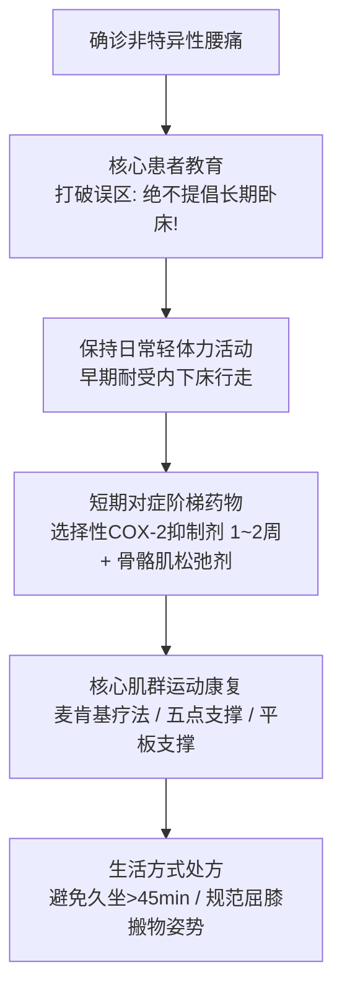

# 非特异性腰痛基层全科诊疗与康复管理指南

- **文献标识**: SRC-CSGP-MSK-2023-01
- **制定机构**: 中华医学会全科医学分会 / 中华医学会骨科学分会
- **刊发刊物**: 《中华全科医师杂志》2023年
- **发布年份**: 2023年

---

## 一、 指南背景与基层诊疗误区

腰痛（Low Back Pain, LBP）是全球及我国成年人致残与损失健康生命年的首要肌肉骨骼系统原因，在基层全科门诊中位列就诊主诉前三位。

基层长期存在两大典型误区：
1. **过度依赖影像学并泛化“腰椎间盘突出”**：将无症状退行性改变过度诊断为严重病变，引起患者医源性焦虑和盲目恐慌；
2. **错误推荐“长期绝对卧床”与滥用输液镇痛**：卧床休息不仅不能加速恢复，反而导致脊柱深层稳定肌群萎缩、关节僵硬及慢性致残风险大增。

本指南旨在指导全科医生识别并排除特异性严重病变，规范非特异性腰痛的早期活动、分阶梯镇痛及康复运动处方。

---

## 二、 概念界定与分类

### 1. 非特异性腰痛 (Non-specific Low Back Pain, NLBP)
- **定义**：肋弓下缘以下、臀横纹以上区域的疼痛、酸胀、僵硬，伴或不伴大腿后侧牵涉痛，且**排除了已知的特异性病因（如骨折、肿瘤骨转移、感染、强直性脊柱炎、神经根严重压迫受损及马尾综合征）**；
- **流行病学特征**：占基层全科门诊接诊全部腰痛病例的 **85% ~ 90%**，多由脊柱力学失衡、小关节劳损、棘上韧带炎及肌筋膜疼痛综合征诱发。

### 2. 临床病程分期：
- **急性腰痛**：病程 < 6 周；
- **亚急性腰痛**：病程 6 ~ 12 周；
- **慢性腰痛**：病程 ≥ 12 周（易转为慢性难治性身心障碍）。

---

## 三、 全科“红旗征”紧急排查与“黄旗征”心理社会评估

全科医生首诊腰痛患者的第一任务是**“排雷”**：

### 1. 红旗征（Red Flags）——必须紧急转诊排查的特异性警报
| 警报维度 | 核心临床线索 | 警惕的严重潜在特异性疾病 | 处置决策 |
| :--- | :--- | :--- | :--- |
| **神经急危重症** | **鞍区感觉丧失（会阴部麻木）**、新发大小便失禁或尿潴留、双下肢进行性重度肌力下降 | **马尾综合征 (Cauda Equina Syndrome)** | **属于骨科/神经外科急危急症！必须在 24~48 小时内紧急行急诊减压手术，否则导致终身大小便瘫痪** |
| **恶性肿瘤风险** | 有明确恶性肿瘤病史、不明原因体重骤减、**夜间静息性加重疼痛（平卧完全不缓解甚至更痛）**、发病年龄 >50岁 | 原发或转移性骨肿瘤（肺癌、乳腺癌、前列腺癌骨转移） | 紧急转诊三级医院行脊柱全长 MRI 与 ECT 骨扫描 |
| **脊柱感染征象** | 发热（体温 >38℃）、近期泌尿系或肺部感染史、静脉用药史、局部棘突剧烈叩痛 | 椎间盘炎、脊柱结核、硬膜外脓肿 | 查血常规、CRP、ESR，紧急上转 |
| **脊柱骨折风险** | 轻微跌倒/弯腰即发剧烈剧痛、**长期口服糖皮质激素史**、重度骨质疏松高龄女性 | 脊柱骨质疏松性压缩性骨折 (OVCF) | 急诊行胸腰椎 X 线正侧位片或 MRI |

### 2. 黄旗征（Yellow Flags）——导致转为慢性难治性腰痛的心理社会危险因素
- **灾难化认知**（“我的脊柱彻底废了”、“我下半辈子只能坐轮椅了”）；
- **恐惧-回避信念**（认为任何身体活动都会进一步加重脊柱损伤而不敢翻身起床）；
- 伴随焦虑、抑郁情绪、工作不满意或存在工伤赔偿争议诉讼。
- *全科干预*：应用 BATHE 技术疏导情绪，重构科学疾病认知。

---

## 四、 阶梯式综合治疗与康复运动处方

对于已排除红旗征的非特异性腰痛患者，指南推荐以**非药物干预为主、短期合理阶梯镇痛为辅**的综合康复路径：

### 1. 运动与患者教育核心原则：
- **颠覆错误旧认知**：**坚决反对绝对卧床！**卧床时间严格限制在 **≤ 48 小时**；超过 48 小时的卧床休息不仅不能加速缓解，反而会显著延缓康复速度并促进骨骼肌脱适应；
- 鼓励患者在疼痛可耐受范围内尽早下床行走并维持日常轻度自理活动。

### 2. 阶梯镇痛药物规范：
- **一线首选**：非甾体抗炎药（NSAIDs），优先选用对胃肠道损伤较小的选择性 COX-2 抑制剂（**塞来昔布 200 mg qd 或 依托考昔 60 mg qd**），疗程控制在 **1 ~ 2 周**以内；
- **肌肉痉挛缓解**：伴明显局部肌紧张者联合中枢性骨骼肌松弛剂（**乙哌立松 50 mg tid**）；
- **严格规避滥用**：**非特异性腰痛严禁长期常规使用阿片类强镇痛药**（成瘾性与过度镇静风险）。

### 3. 生活方式与运动处方：
- **物理疗法**：急性期冷敷/局部热敷；
- **核心稳定肌群锻炼**：五点支撑法（臀桥）、飞燕式、麦肯基（McKenzie）伸展疗法；
- **人体工效学防护**：避免持续久坐超过 45 分钟；提举重物时坚持“屈髋屈膝、背部挺直、靠近身体”的人体力学姿势。
