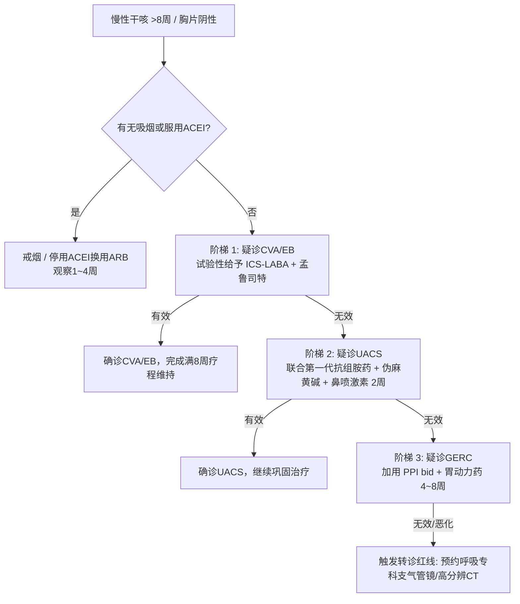

# 慢性咳嗽基层诊疗指南（2021年）

- **文献标识**: SRC-CSGP-SYMP-2021-02
- **制定机构**: 中华医学会全科医学分会 / 中华医学会呼吸病学分会哮喘学组 / 《中华全科医师杂志》编辑委员会
- **刊发刊物**: 《中华全科医师杂志》2021年第20卷第4期
- **发布年份**: 2021年

---

## 一、 指南背景与基层抗生素滥用痛点

咳嗽是基层呼吸道门诊就诊首位主诉。在全科日常接诊中，“慢性咳嗽”存在广泛的诊疗误区：大量基层医生将长期咳嗽习惯性归结为“慢性支气管炎”或“咽炎”，长期反复滥用广谱抗生素（头孢菌素、阿奇霉素、呼吸喹诺酮等）甚至静脉输液，既造成抗菌药物耐药，又严重延误真实病因治疗。

本指南旨在规范基层慢性咳嗽的定义、解剖学诊断程序、排查诱因（特别是降压药不良反应），推行阶梯式经验性诊断与规范药物治疗。

---

## 二、 慢性咳嗽定义与全科排除诊断流程

### 1. 慢性咳嗽确诊三要素：
- **病程界定**：咳嗽持续时间 **> 8 周**；
- **影像学特征**：**胸部 X 线平片或胸部高分辨率 CT 检查未见明显器质性肺实质病变**；
- **临床特征**：以咳嗽为唯一主诉或主要症状。

### 2. 首要必排项：药物性咳嗽（ACEI 类降压药诱导）
- **发病机制**：[[RAS抑制剂]] 中的 ACEI 类药物（卡托普利、依那普利、培哚普利等）抑制激肽酶 II 活性，导致呼吸道局部缓激肽和 P 物质异常降解受阻并大量蓄积，刺激迷走神经感觉 C 纤维引起顽固性干咳；
- **临床特征**：在我国人群中发生率高达 10%~20%，多在服药数周至数月后出现刺激性干咳，白天多见；
- **全科处置黄金准则**：详细核对高血压患者用药史，凡服用 ACEI 者，**首先停用 ACEI 至少 1~4 周**，观察咳嗽是否自行缓解；降压药改用无咳嗽副作用的 ARB（缬沙坦、氯沙坦）或 CCB（氨氯地平）。

---

## 三、 全科四大常见病因与特异性鉴别

排查吸烟及 ACEI 药物因素后，**以下四类疾病占不明原因慢性咳嗽病因的 70% ~ 90% 以上**：

| 常见病因名称 | 典型临床特征与诱因 | 基层推荐辅助检查 | 一线特异性治疗方案与疗程 |
| :--- | :--- | :--- | :--- |
| **咳嗽变异性哮喘 (CVA)** | • 刺激性干咳，夜间及清晨最为剧烈 • 冷空气、粉尘、油烟及运动诱发 • 支气管舒张剂（沙丁胺醇）有效 | • 支气管激发试验阳性 • 呼出气一氧化氮 (FeNO) 升高 • PEF 日内变异率 >13% | • **吸入糖皮质激素联合长效β2受体激动剂 (ICS-LABA)**（如布地奈德福莫特罗） • 规则治疗至少 **8 周以上** • 可加用白三烯受体拮抗剂（孟鲁司特） |
| **上气道咳嗽综合征 (UACS)** *(既往称鼻后滴流综合征 PNDS)* | • 伴鼻塞、鼻痒、打喷嚏、流脓涕 • 感觉有分泌物滴入咽喉部，频繁清嗓 • 查体见咽后壁“鹅卵石样”淋巴滤泡增生及黏液附着 | • 鼻内镜检查 • 副鼻窦 CT 平扫 | • **第一代抗组胺药（马来酸氯苯那敏）+ 伪麻黄碱**减充血剂 • 联合鼻用糖皮质激素（糠酸莫米松） • 疗程 2~4 周 |
| **嗜酸粒细胞性支气管炎 (EB)** | • 慢性刺激性干咳，无喘息 • 肺通气功能正常，气道反应性阴性 • 诱导痰嗜酸粒细胞比例 ≥2.5% | • 诱导痰细胞学分类计数 • FeNO 显著升高 | • **吸入糖皮质激素 (ICS)**（布地奈德或氟替卡松） • 疗程通常持续 **4 周以上** |
| **胃食管反流性咳嗽 (GERC)** | • 进食酸性、油腻食物或咖啡后咳嗽加重 • 平卧及夜间易发作 • 伴烧心、反酸、嗳气（但约20%仅有咳嗽而无消化道典型症状） | • 消化内镜 • 24小时食管下段阻抗-pH监测 | • **强效抑酸剂（PPI 双倍剂量/每日2次）** • 联合胃肠促动力药（多潘立酮/莫沙必利） • **疗程至少 8 周方能显效** |

---

## 四、 基层全科阶梯式经验性治疗路径与转诊红线

对于缺乏肺功能或诱导痰检测条件的基层医疗机构，指南推荐遵循“**由常见病到少见病、阶梯式经验性试验性治疗**”流程：

### 紧急转诊红线（Red Flags）：
出现以下情况时，禁止继续在基层进行经验性治疗，必须立即转诊至二/三级综合医院呼吸科：
1. 伴有咯血、痰中带血丝；
2. 伴有无法解释的进行性消瘦、盗汗、贫血或恶病质；
3. 伴有静息性进行性呼吸困难、杵状指（趾）；
4. 40岁以上长期重度吸烟者咳嗽性质突变（金属音调、刺激性加剧）；
5. 阶梯式经验性治疗完成 2 个周期依然完全无效。
