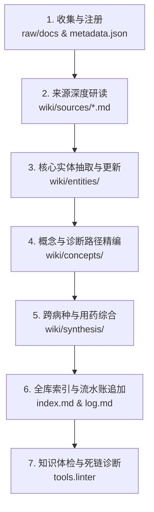

# 权威指南入库与知识编译作业指引 (Ingest & Compilation Guide)

本指引规范了如何将一份全新的中国权威医学指南或标准，从原始文本摄入转化为高质量持久化的 LLM Wiki 知识节点。

---

## 一、 标准入库流水线（7步法）



### 第 1 步：来源文档注册 (Register Raw Source)
1. 将权威官方文件、PDF转Markdown或权威全文放入 `raw/docs/<source_id>.md`。
2. 在 `raw/metadata.json` 中登记核心元数据：
   - `id`: 全局唯一源标识（例如 `SRC-CMA-CARD-2024-01`）
   - `title`: 官方正式中文名称
   - `authority`: 发布权威（如 中华医学会心血管病学分会）
   - `year`: 发布年份
   - `category`: 专科分类（心血管 / 内分泌 / 呼吸 / 肿瘤 / 神经 / 感染 / 公共卫生）
   - `doi_or_url`: 官方刊发位置或公开发布链接
   - `key_scope`: 本指南主要规制的病种与临床范围

### 第 2 步：来源精编解析 (Compile Source Page)
在 `wiki/sources/<source_name>.md` 创建文档，严格包含：
- **背景与制定目的**
- **相较历史版本的核心更新要点（关键突破）**
- **核心推荐条款逐条拆解（附带推荐级别与证据等级）**
- **涉及的核心实体、概念与受影响页面导航**

### 第 3 步：实体页面更新 (Entities Compilation)
更新或创建对应的实体页面：
- **疾病实体 (`wiki/entities/diseases/`)**：更新流行病学切点、病因分型、中国临床诊断核心标准、治疗一线/二线梯队、随访规范。
- **药物实体 (`wiki/entities/drugs/`)**：明确作用机制、适应症等级、一线首选用药地位、禁用禁忌、不良反应监测指标。
- **权威机构实体 (`wiki/entities/organizations/`)**：记录发布机构的权威背景与旗下系列指南。

### 第 4 步：概念与路径精编 (Concepts & Pathways)
将具体的量表、分期系统、诊疗流程图转化为概念节点：
- 例如：`[[高血压分级与靶器官损害评估]]`、`[[2型糖尿病诊断切点与血糖控制目标]]`、`[[CNLC中国肝癌分期系统]]`、`[[CURB-65肺炎严重度评分]]` 等。
- 给出清晰的分级表格、诊断切点数值、判定标准。

### 第 5 步：综合与共病专题合成 (Cross-Disease Synthesis)
更新或新增 `wiki/synthesis/` 页面：
- 考察新指南与既有其他疾病指南的交叉点。
- 常见共病（如高血压合并糖尿病、慢阻肺合并缺血性心脏病、晚期肿瘤靶向免疫治疗并发症等）。
- 梳理多药联合用药禁忌（如 ACEI 与 ARB 不联合使用、替格瑞洛与特定抗真菌药代谢相互作用等）。

### 第 6 步：索引更新与流水账追加 (Index & Log Update)
1. 在 `wiki/index.md` 对应分类下挂载新页面的链接与一句话精要介绍。
2. 在 `wiki/log.md` 按照标准时间格式追加流水操作记录：
   ```markdown
   ## [2026-10-06] ingest | 《中国高血压防治指南（2024年修订版）》
   - 原始文档 ID: SRC-CMA-CARD-2024-01
   - 更新实体: [[原发性高血压]], [[钙通道阻滞剂]], [[RAS抑制剂]], [[ARNI]]
   - 新增概念: [[高血压分级与靶器官损害评估]], [[高血压分型与分期管理]]
   - 更新综合: [[心血管与代谢性疾病共病管理]]
   ```

### 第 7 步：自动化质检与体检 (Run Lint)
运行知识库质检命令：
```bash
python3 -m tools.cli lint
```
确保全库 0 断链、0 孤立页面，元数据完全闭环。
