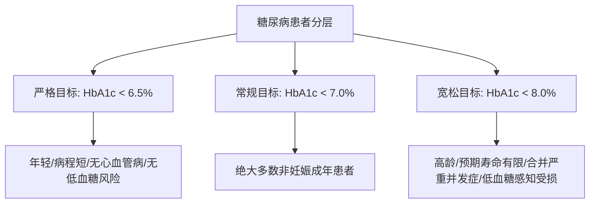

# 2型糖尿病诊断切点与控制目标

## 一、 糖代谢状态与诊断切点
根据《中国2型糖尿病防治指南（2024版）》（[[SRC-CDS-ENDO-2024-01]]），糖代谢状态分类完全基于静脉血浆葡萄糖及标准化糖化血红蛋白测定：

| 糖代谢状态 | 空腹血糖 (FPG, mmol/L) | | OGTT 2小时血糖 (mmol/L) | 标准化 HbA1c (%) |
| :--- | :--- | :--- | :--- | :--- |
| **正常血糖** | < 6.1 | 且 | < 7.8 | < 5.7% |
| **空腹血糖受损 (IFG)** | 6.1 ～ 6.9 | 且 | < 7.8 | 5.7% ～ 6.4% |
| **糖耐量减低 (IGT)** | < 7.0 | 且 | 7.8 ～ 11.0 | 5.7% ～ 6.4% |
| **糖尿病 (Diabetes)** | **≥ 7.0** | 或 | **≥ 11.1** | **≥ 6.5%** |

*注：若无典型高血糖三多一少症状（烦渴多饮、多尿、多食、体重下降），诊断必须在改日复查核实。*

---

## 二、 血糖综合控制目标体系

### 1. 综合代谢控制目标（中国成人综合达标标准）：
- **糖化血红蛋白（HbA1c）**：**< 7.0%**
- **空腹静脉血糖**：4.4 ～ 7.0 mmol/L
- **餐后2小时血糖**：< 10.0 mmol/L
- **血压控制目标**：**< 130/80 mmHg**
- **血脂控制目标**：
  - 合并 ASCVD 极高危：LDL-C < 1.4 mmol/L 且较基线降幅 ≥ 50%；
  - 高危心血管风险：LDL-C < 1.8 mmol/L 且较基线降幅 ≥ 50%。

### 2. 个体化 HbA1c 目标分层：

---

## 三、 关联页面与反向引用
- **疾病实体**: [[2型糖尿病]], [[原发性高血压]], [[慢性心力衰竭]]
- **降糖药物**: [[二甲双胍]], [[SGLT2抑制剂]], [[GLP-1受体激动剂]]
- **综合专题**: [[心脑血管与代谢性疾病共病管理]], [[慢病多药联合安全与禁忌规避]]
