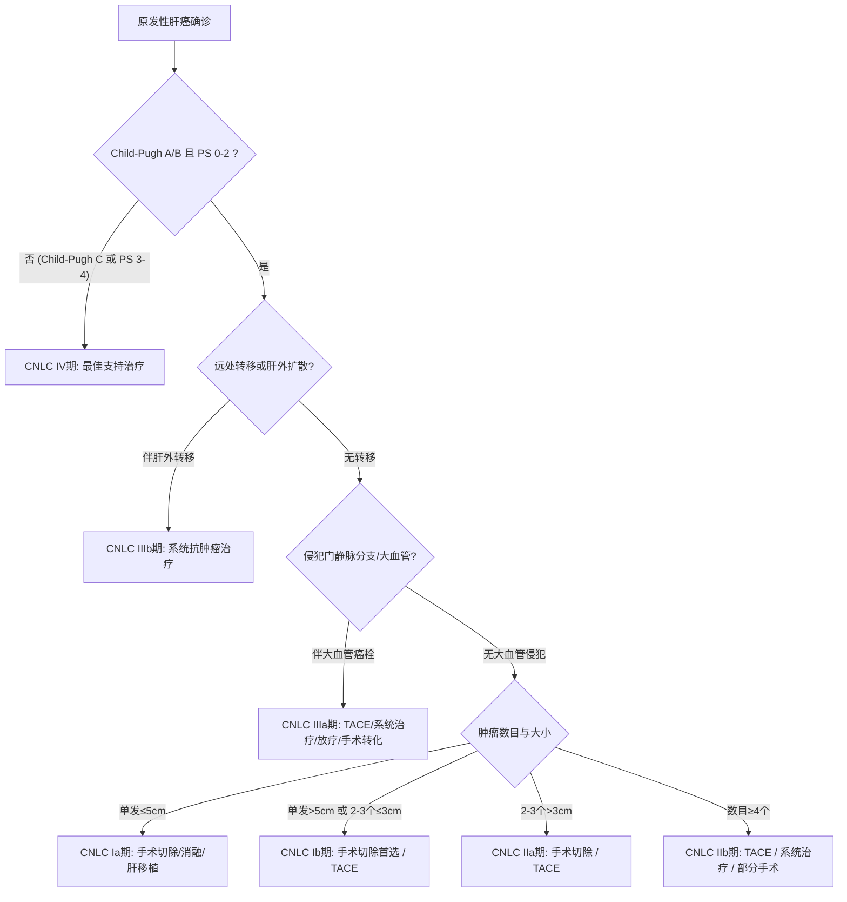

# CNLC 中国肝癌临床分期系统

## 一、 体系背景与制定依据
中国肝癌临床分期（China Liver Cancer Staging, CNLC）由国家卫生健康委《原发性肝癌诊疗指南（2024年版）》（[[SRC-NHC-ONC-2024-01]]）推荐。相较于国际巴塞罗那分期（BCLC），CNLC 更契合我国以乙肝病毒感染、伴随较严重肝硬化背景的临床实际，系统指导从根治切除、介入、消融到系统抗肿瘤治疗的路径分流。

---

## 二、 CNLC 分期细则与首选治疗路径

---

## 三、 分期详细指标定义表
| CNLC 分期 | 肿瘤负荷与病灶分布 | 血管受累与转移状态 | 肝功能及体力状态 | 首选治疗模式 |
| :--- | :--- | :--- | :--- | :--- |
| **Ia 期** | 单发，最大径 ≤ 5 cm | 无血管侵犯，无远处转移 | Child-Pugh A/B, PS 0～2 | 手术切除、局部消融（≤3cm）、肝移植 |
| **Ib 期** | 单发，最大径 > 5 cm；或 2～3个病灶，最大径 ≤ 3 cm | 无血管侵犯，无远处转移 | Child-Pugh A/B, PS 0～2 | 手术切除（解剖性切除）、TACE |
| **IIa 期** | 2～3个病灶，最大径 > 3 cm | 无血管侵犯，无远处转移 | Child-Pugh A/B, PS 0～2 | 手术切除、TACE |
| **IIb 期** | 病灶数目 ≥ 4 个 | 无血管侵犯，无远处转移 | Child-Pugh A/B, PS 0～2 | TACE、系统抗肿瘤治疗、手术切除 |
| **IIIa 期** | 伴门静脉分支或下腔静脉癌栓 | 局限于血管内癌栓，无远处转移 | Child-Pugh A/B, PS 0～2 | TACE、HAIC、系统靶向免疫、转化手术 |
| **IIIb 期** | 伴肝外淋巴结转移或远处脏器转移 | 伴远处转移 | Child-Pugh A/B, PS 0～2 | 系统抗肿瘤治疗（靶免联合一线） |
| **IV 期** | 终末期 | 不论肿瘤情况 | **Child-Pugh C** 或 **PS 3～4** | 姑息对症与最佳支持治疗（BSC） |

---

## 四、 关联页面与反向引用
- **疾病实体**: [[原发性肝癌]]
- **核心疗法**: [[免疫检查点抑制剂]]
- **综合专题**: [[恶性肿瘤转化治疗与MDT决策路径]]
