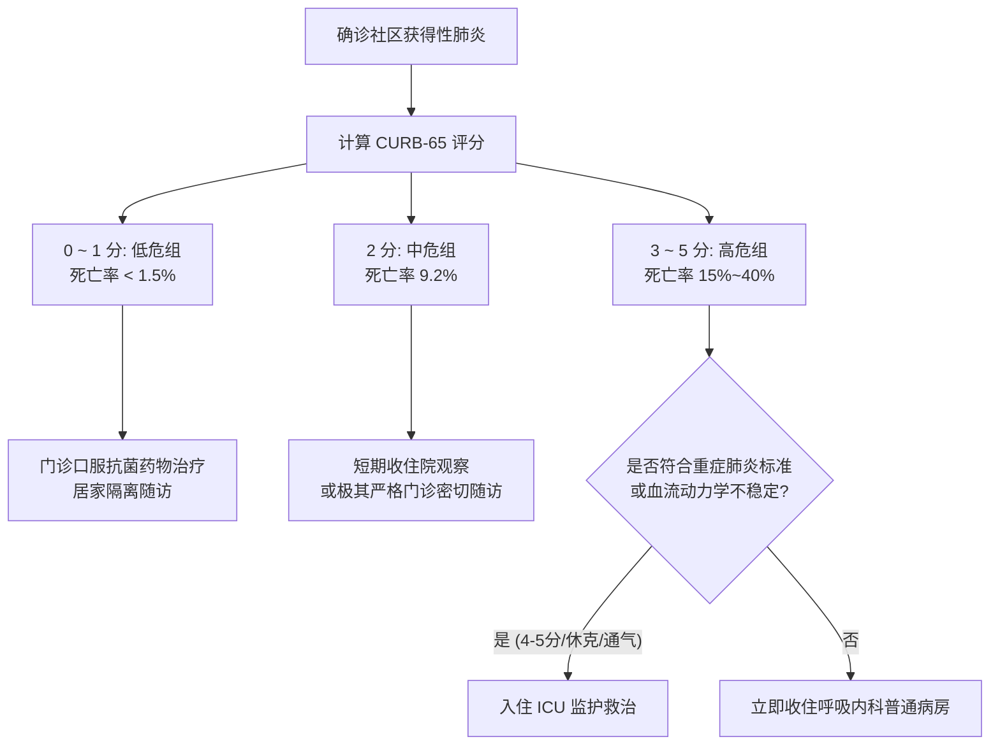

# CURB-65 社区获得性肺炎严重度评分

## 一、 评分定义与量化指标
CURB-65 评分系统由中华医学会呼吸病学分会《中国成人社区获得性肺炎诊断和治疗指南》（[[SRC-CMA-RESP-2016-02]]）强烈推荐，是指导临床医师评估 CAP 患者 30 天死亡风险并作出收治场所决策（门诊、住院、ICU）的标准化工具。

每个项目符合记 1 分，总分为 0 ~ 5 分：

| 字母代码 | 评估指标 | 判定临界值 | 计分 |
| :--- | :--- | :--- | :--- |
| **C** | **Confusion**（意识状态） | 新近出现的意识模糊、定向力障碍 | 1 分 |
| **U** | **Urea**（血尿素氮） | BUN > 7.0 mmol/L（> 20 mg/dL） | 1 分 |
| **R** | **Respiratory rate**（呼吸频率） | 呼吸频率 ≥ 30 次/分 | 1 分 |
| **B** | **Blood pressure**（血压状态） | 收缩压 < 90 mmHg 或 舒张压 ≤ 60 mmHg | 1 分 |
| **65** | **Age**（高龄因素） | 年龄 ≥ 65 岁 | 1 分 |

---

## 二、 危险度分级与治疗场所推荐决策

---

## 三、 结合重症 CAP（SCAP）诊断标准的综合判定
若患者出现以下情况，不论 CURB-65 得分多少，直接诊断为重症肺炎，立即送收 ICU：
1. **主要标准（符合1项即可）**：
   - 气管插管需有创机械通气；
   - 脓毒性休克经充分补液后仍需升压药维持。
2. **次要标准（符合3项及以上）**：
   - PaO2/FiO2 ≤ 250 mmHg；多肺叶浸润；WBC < 4.0×10⁹/L；PLT < 100×10⁹/L；低体温（< 36.0℃）。

---

## 四、 关联页面与反向引用
- **疾病实体**: [[社区获得性肺炎]], [[慢性阻塞性肺疾病]]
- **用药方案**: [[限制与特殊级抗菌药物]]
- **综合专题**: [[临床感染经验性治疗降阶梯与抗菌药物合理应用]]
