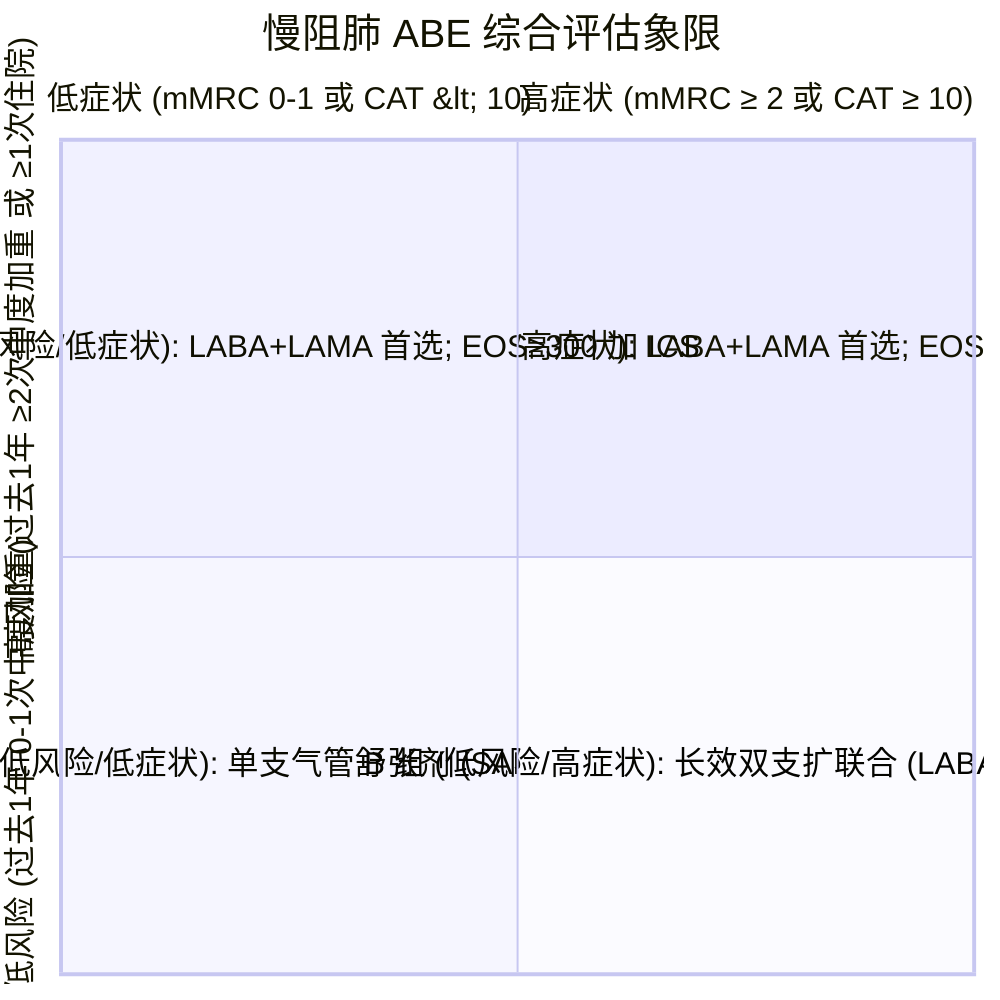

# GOLD 气流受限分级与 ABE 综合评估系统

## 一、 肺功能气流受限严重程度分级 (GOLD 1～4 级)
根据《慢性阻塞性肺疾病诊治指南（2021年修订版）》（[[SRC-CMA-RESP-2021-01]]），在患者吸入支气管舒张剂后，首先必须确认存在持续气流受限（**FEV1 / FVC < 0.70**），随后依据 FEV1 占预计值百分比（FEV1 % pred）划定严重程度：

| GOLD 级别 | 严重度定性 | 肺功能临界指标 (FEV1 % pred) | 临床特征与病理阶段 |
| :--- | :--- | :--- | :--- |
| **GOLD 1 级** | 轻度 | **≥ 80%** | 轻微活动后呼吸困难，常被患者忽视 |
| **GOLD 2 级** | 中度 | **50% ≤ FEV1 % pred < 80%** | 平地步行气促，日常活动轻度受限 |
| **GOLD 3 级** | 重度 | **30% ≤ FEV1 % pred < 50%** | 稍活动即气喘，频发咳嗽咳痰与急性加重 |
| **GOLD 4 级** | 极重度 | **< 30%** | 严重呼吸衰竭或合并慢性肺源性心脏病 |

---

## 二、 稳定期综合评估模型（ABE 分组矩阵）
慢阻肺不仅关注肺功能单项指标，更关注“患者生活质量症状负荷”与“未来发生急性加重的风险”。目前国际与中国指南将以往的 ABCD 评估优化为 **ABE 评估体系**（将高风险的 C 组与 D 组整合为 E 组，凸显急性加重恶化事件的干预核心地位）：

### 分组用药指征明细：
1. **A 组（低症状、低风险）**：
   - 起始推荐：单药支气管舒张剂（短效 SABA 或长效 LAMA/LABA）。
2. **B 组（高症状、低风险）**：
   - 起始推荐：**长效双支扩联合（LABA + LAMA）**（如乌美溴铵/维兰特罗），显著由于单支扩单药。
3. **E 组（高急性加重风险，不论症状轻重）**：
   - 起始推荐：**长效双支扩联合（LABA + LAMA）**；
   - **升级为三联吸入制剂（LABA + LAMA + ICS）的指征**：
     - 若外周血嗜酸性粒细胞计数 **EOS ≥ 300 /μL**，直接首选三联制剂；
     - 若双支扩治疗后仍有加重且 **100 ≤ EOS < 300 /μL**，可加用 ICS；
     - 若 **EOS < 100 /μL** 或反复罹患肺炎，**严禁加用 ICS**。

---

## 三、 关联页面与反向引用
- **疾病实体**: [[慢性阻塞性肺疾病]], [[社区获得性肺炎]]
- **综合专题**: [[慢阻肺与心血管共病联合诊治]]
