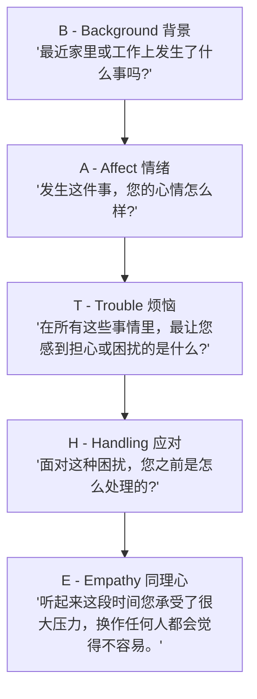

# 全科以人为中心接诊与BATHE问诊技巧

## 一、 “以人为中心”全科医学接诊模型
根据《全科医疗服务中以人为中心健康照顾与接诊规范专家共识》（[[SRC-CSGP-GP-2023-01]]），专科医生多关注“客观的生物学疾病（Disease）”，而全科医生必须同时关注“患者独特的患病体验（Illness）”：
- **FIFE 评估维度**：
  - **Feelings (感受)**：患者对不舒服的主观恐惧或情绪；
  - **Ideas (想法)**：患者自己认为可能患了什么病；
  - **Function (功能影响)**：病痛如何影响了工作、睡眠或家庭角色；
  - **Expectations (期望)**：患者希望本次就诊得到什么帮助（是开药、做检查还是排除癌症疑虑）。

---

## 二、 BATHE 快速心理支持问诊模型

BATHE 技术是一种由 Stuart 和 Lieberman 开发并在中国全科医学界广泛推行的**简易心理干预沟通工具**。在门诊接诊中，全科医生仅需投入 3～5 分钟，即可迅速穿透躯体主诉表层，有效评估患者的心理应激源、情绪反应并建立稳固的医患信任同盟：

### 临床话术解析表：
| 步骤字母 | 英文要素 | 中文推荐启发式提问话术 | 全科医生的倾听要点 |
| :--- | :--- | :--- | :--- |
| **B** | **Background (背景)** | “除了今天头晕/胃痛，最近您的生活、工作或家庭有什么重大事情发生吗？” | 寻找诱发躯体化症状的重大生活事件或慢性人际关系冲突 |
| **A** | **Affect (情绪)** | “遇到这样的情况，您内心最真实的感受和情绪是什么？” | 允许患者宣泄并用词汇界定其情绪（如焦虑、愤怒、沮丧、绝望） |
| **T** | **Trouble (烦恼)** | “在所有这些不舒服和麻烦当中，**最让您揪心或感到困扰的核心是什么**？” | **直击隐匿就诊议程（Hidden Agenda）**，常常发现患者是担心自己患了绝症 |
| **H** | **Handling (应对)** | “针对这种担忧和身体不舒服，您目前尝试过哪些办法来应对？” | 评估患者的应对成熟度（是积极求助还是借酒消愁、逃避卧床） |
| **E** | **Empathy (同理心)** | “我非常能理解您的处境，摊上这种事情，感到委屈和焦虑是完全正常的。” | 给予无条件的情感接纳与精神赋能，卸下心理防御 |

---

## 三、 BATHE 技术的禁忌与应用界限
1. **禁忌证**：
   - 处于危及生命的急性器质性急症状态（如急性胸痛大汗、昏迷、严重呼吸困难、休克）；
   - 处于急性精神病重度躁狂或精神分裂症幻觉妄想发作期；
   - 存在明确急性自杀/暴力危机倾向。
2. **适用主诉场景**：
   - 常见反复就诊但各项生化检查阴性的未分化躯体主诉（反复头昏、功能性胸闷、肠易激综合征、失眠、慢性疲劳）；
   - 慢性病依从性极差、家庭成员照料负担过重的老年慢病患者。

---

## 四、 关联页面与反向引用
- **权威指南来源**: [[SRC-CSGP-GP-2023-01]]
- **核心配套规范**: [[全科SOAP病历书写规范]]
- **关联综合专题**: [[以家庭为单位慢病连续性管理与生活方式处方]], [[基层全科门诊常见未分化主诉排雷与转诊决策]]
- **权威学术组织**: [[中华医学会全科医学分会]]
