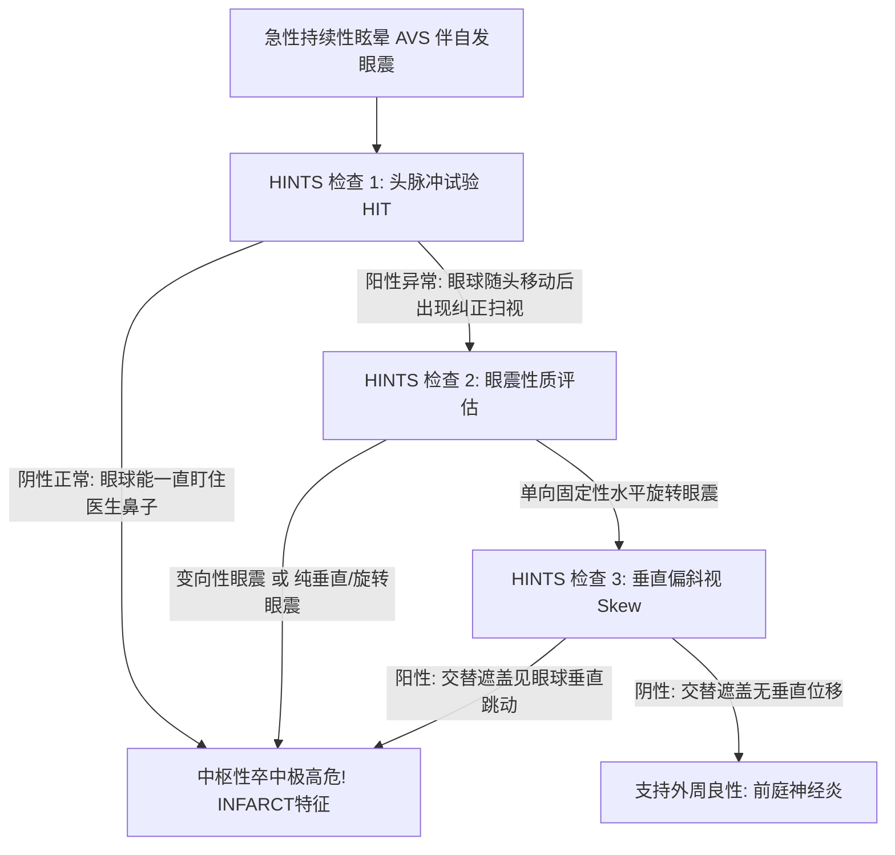

# 头晕眩晕HINTS三步床旁检查与红旗征

## 一、 临床背景：急性前庭综合征（AVS）的致命陷阱
急性前庭综合征（Acute Vestibular Syndrome, AVS）是指急性发作、持续数天至数周的严重眩晕或头晕，伴随自发性眼球震颤、步态不稳、恶心呕吐和运动不耐受。在基层门诊，约 80%～90% 的 AVS 属于良性自限性的外周性**前庭神经炎**；但约 **10% ～ 20%** 的患者是由极其致命的**后循环（小脑或脑干）缺血性卒中**引起的。

在发病超早期（24～48小时内），急诊头颅 MRI 弥散加权成像（DWI）仍有高达 **12% ～ 20% 的假阴性率**。循证医学证实，熟练掌握床旁 **HINTS 三步物理检查法**（敏感度达 97%～99%，特异度达 96%），其排除中枢性脑梗死的准确率显著优于超早期 MRI！

---

## 二、 床旁 HINTS 三步物理检查法（Head Impulse, Nystagmus, Test of Skew）

### 记忆助记词：INFARCT（中枢卒中特征）
只要满足以下三项中任意一项，即可确认为中枢性卒中：
- **I** - **I**mpulse Normal (头脉冲试验正常)
- **N** - **F**ast-phase **A**lternating (快相方向改变性眼震)
- **R** - **R**e-fixation on **C**over **T**est (遮盖试验眼球垂直纠正跳动)

### 详细操作指南：
1. **第一步：头脉冲试验（Head Impulse Test, HIT，又称前庭-眼反射试验 VOR）**：
   - 嘱患者固定注视医生的鼻尖，医生双手托住患者头部，以极快的速度、小幅度（约10°～20°）向左或向右水平快速转动患者头部；
   - **外周性病变（如前庭神经炎）**：患侧前庭眼反射受损，快速转头时眼球无法固定在鼻尖上，而是随头部转动偏离，随后出现一次快速反向的**代偿性扫视运动（Catch-up Saccade）重新看回鼻尖**（试验阳性/异常）；
   - **中枢性卒中（小脑/脑干卒中）**：前庭-眼反射弧完好，转头时眼球始终能牢牢钉在医生鼻尖上，**完全没有纠正性扫视（试验正常/阴性）！**
2. **第二步：自发眼震特征观察（Nystagmus）**：
   - 观察患者平视、向左凝视、向右凝视时的眼震表现；
   - **外周性眼震**：快相始终朝向单一健侧（单向性眼震），凝视快相侧时眼震加剧（Alexander定律），不会随注视方向改变而翻转方向；
   - **中枢性眼震**：向左看时眼震向左，向右看时眼震向右（**凝视诱发方向改变性眼震**）；或者出现**纯垂直向上/向下跳动眼震、纯旋转眼震**。
3. **第三步：眼球垂直偏斜测试（Test of Skew）**：
   - 采用交替遮盖试验（Cover-Uncover Test）：交替快速遮盖患者左眼和右眼；
   - **中枢性病变（脑干前庭核或小脑通路受损）**：移开遮盖板瞬间，被遮盖的眼球会出现垂直方向（向上或向下）的微小复位跳动（**垂直倾斜眼偏斜 Skew Deviation**）；
   - **外周性病变**：无垂直移位跳动。

---

## 三、 全科门诊头晕/眩晕紧急转诊“红旗征（Red Flags）”

在基层全科接诊中，只要头晕/眩晕患者出现以下任何一条“红旗征”，**严禁继续在基层观察，必须立即呼叫 120 绿色通道送往上级综合医院急诊科/卒中中心**：

1. **伴发局部神经系统定位体征**：新发复视（视物成双）、面部麻木、周围性或中枢性面瘫、构音障碍（言语不清）、饮水呛咳、吞咽困难、单侧肢体无力或感觉减退；
2. **严重姿势失衡（共济失调）**：在有人搀扶或睁眼状态下，患者**完全无法独立坐稳、站立或行走，向一侧倾倒跌倒**（典型小脑大面积卒中体征）；
3. **伴发新发突发剧烈头痛**：特别是后枕部刀割样剧痛、颈后部僵硬伴呕吐（警惕小脑出血或蛛网膜下腔出血）；
4. **伴发新发单侧听力断崖式下降或耳聋**（警惕内听动脉栓塞）；
5. **床旁 HINTS 检查呈现中枢性特征**（HIT正常、方向变换性眼震或垂直偏斜阳性）；
6. 伴有高危心血管警报：胸骨后压榨性胸痛、心悸大汗、平卧血压收缩压 <90 mmHg。

---

## 四、 关联页面与反向引用
- **权威指南来源**: [[SRC-CSGP-SYMP-2020-01]]
- **适应疾病实体**: [[良性阵发性位置性眩晕]], [[急性缺血性脑卒中]]
- **治疗药物与手法**: [[前庭抑制剂与耳石复位手法]]
- **综合专题协同**: [[基层全科门诊常见未分化主诉排雷与转诊决策]]
- **权威学术组织**: [[中华医学会全科医学分会]]
