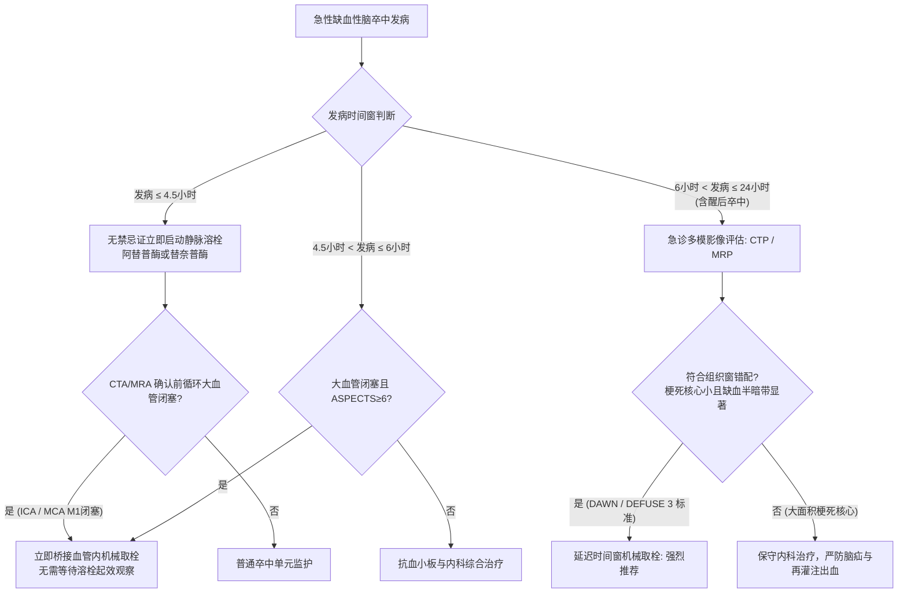

# 急性缺血性脑卒中静脉溶栓与取栓时间窗

## 一、 静脉溶栓标准时间窗与药物规范（发病 ≤ 4.5 小时）
根据《中国急性缺血性脑卒中诊治指南（2023）》（[[SRC-CMA-NEUR-2023-01]]），静脉溶栓必须遵循“时间就是大脑”原则，DNT（入院至用药时间）≤ 60 分钟。

### 1. 适用药物与给药细则：
- **[[阿替普酶与替奈普酶]]**（rt-PA）：
  - 剂量 0.9 mg/kg（最大 90 mg），10% 1分钟推注，90% 维持 60 分钟滴注（I类推荐，A级证据）。
- **替奈普酶**（TNK）：
  - 剂量 0.25 mg/kg（最大 25 mg），5～10 秒单次静脉推注（I类推荐，B级证据）。

### 2. 绝对禁忌证快速排查清单：
- 头颅平扫 CT 证实脑出血或蛛网膜下腔出血；
- 近 3 个月有严重颅脑外伤或脑梗死；
- 恶性颅内肿瘤或颅内动静脉畸形；
- 活动性内脏大出血；
- 血压极高（经积极平稳降压后仍 SBP ≥ 185 mmHg 或 DBP ≥ 110 mmHg）；
- 血液凝血异常（血小板 < 100 × 10⁹/L，INR > 1.7，48小时内使用 NOAC）。

---

## 二、 血管内治疗（机械取栓）时间窗决策树

---

## 三、 溶栓后 24 小时抗栓铁律
- **溶栓后 24 小时内绝对推迟抗血小板与抗凝治疗**；
- 溶栓满 24 小时后，**必须复查头颅平扫 CT**，确认无任何出血转化后方可启动抗血小板治疗（阿司匹林或氯吡格雷）。

---

## 四、 关联页面与反向引用
- **疾病实体**: [[急性缺血性脑卒中]]
- **核心药物**: [[阿替普酶与替奈普酶]]
- **综合专题**: [[慢病多药联合安全与禁忌规避]]
