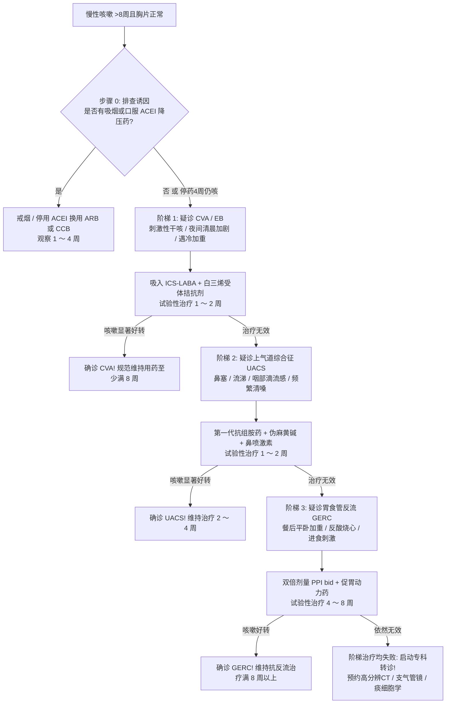

# 慢性咳嗽病因解剖学阶梯诊断路径

## 一、 临床背景：解剖学诊断程序 (Anatomical Diagnostic Protocol)
人体咳嗽反射弧由迷走神经、舌咽神经及三叉神经的分支纤维支配，受体广泛分布于外耳道、鼻腔、咽喉、气管支气管树、心包及食管。根据《慢性咳嗽基层诊疗指南》（[[SRC-CSGP-SYMP-2021-02]]），对于咳嗽持续 **> 8 周且胸片无器质性实质病变**的患者，推荐采用**解剖学自上而下的阶梯式病因排查路径**，能使病因确诊率达到 85%～95% 以上。

---

## 二、 基层全科阶梯式排查与经验性试验流程

---

## 三、 四大病因特征与观察时间窗矩阵

| 阶梯次序 | 疑诊疾病 | 核心病理机制 | 典型临床问诊线索 | 基层试验性药物 | 显效与疗程窗口期 |
| :--- | :--- | :--- | :--- | :--- | :--- |
| **步骤 0** | **药物性咳嗽** | 缓激肽蓄积刺激气道 C 纤维 | 服用卡托普利、依那普利、培哚普利等 | **停用 ACEI 改用 ARB/CCB** | 停药 **1 ～ 4 周** 咳嗽自愈 |
| **阶梯 1** | **咳嗽变异性哮喘 (CVA)** | 嗜酸性气道炎症伴气道高反应性 | 刺激性干咳，夜间或凌晨加重，闻及油烟/冷空气加剧，支气管舒张剂显效 | 吸入布地奈德福莫特罗 + 孟鲁司特钠 | **1 ～ 2 周显效**，必须维持治疗满 **8 周** |
| **阶梯 2** | **上气道咳嗽综合征 (UACS)** | 鼻咽分泌物倒流刺激喉下迷走感觉受体 | 鼻痒喷嚏、咽后壁黏液附着滴漏感、频繁用力清嗓、喉痒 | 马来酸氯苯那敏 + 伪麻黄碱 + 糠酸莫米松鼻喷 | **1 ～ 2 周显效**，维持治疗 **2 ～ 4 周** |
| **阶梯 3** | **胃食管反流性咳嗽 (GERC)** | 酸或弱酸反流刺激食管下段迷走神经反射 | 饱餐油腻/酸食后加重，日间咳嗽，平卧嗳气（部分可无反酸） | 埃索美拉唑 20mg bid + 莫沙必利 5mg tid | 起效慢（**需 2 ～ 4 周**方起效），必须服满 **8 周** |

---

## 四、 基层处置禁忌与专科转诊指征

### 1. 基层三大禁忌行为：
- **严禁滥用广谱抗生素**：无黄脓痰、无发热及无白细胞增高者，严禁静脉或口服抗菌药；
- **严禁滥用成瘾性强镇咳药**：可待因长期口服诱发成瘾并抑制排痰；
- **严禁见好就收提前停药**：CVA 治疗不可因用药数天咳嗽好转而过早自行停药。

### 2. 及时专科转诊指征：
- 伴咯血、痰中带血；
- 伴进行性呼吸困难、杵状指、胸痛或声嘶；
- 伴全身恶病质（不明原因体重半年内下降 >5%）；
- 严格完成阶梯经验性治疗无任何缓解者。

---

## 五、 关联页面与反向引用
- **权威指南来源**: [[SRC-CSGP-SYMP-2021-02]]
- **适应疾病实体**: [[慢性咳嗽]]
- **核心用药实体**: [[慢性咳嗽阶梯治疗药物]], [[RAS抑制剂]]
- **综合专题协同**: [[基层全科门诊常见未分化主诉排雷与转诊决策]], [[慢病多药联合安全与禁忌规避]]
- **权威学术组织**: [[中华医学会全科医学分会]]
