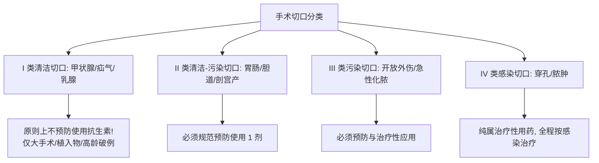

# 抗菌药物三级处方权限与围手术期预防规范

## 一、 抗菌药物三级分级与处方权限矩阵
根据国家卫生健康委《抗菌药物临床应用指导原则》（[[SRC-NHC-PHAR-2015-01]]），我国医疗机构实行三级动态处方权限管理：

| 级别分类 | 药物特征与代表品种 | 处方医师资质要求 | 审批与流程红线 |
| :--- | :--- | :--- | :--- |
| **非限制使用级** | 安全、有效、价廉、对耐药性影响小（如阿莫西林、头孢唑林、青霉素） | 取得处方权的执业医师（含初级住院医师） | 独立开具 |
| **限制使用级** | 对耐药性影响较大、价格较高（如头孢曲松、莫西沙星、左氧氟沙星、头孢呋辛） | **主治医师及以上**专业技术职务任职资格 | 住院医师仅可急诊开具1日量，次日补签 |
| **特殊使用级** | 不良反应严重、易诱导严重耐药、价格昂贵（碳青霉烯类、万古霉素、利奈唑胺、多黏菌素） | **副主任医师及以上**专业技术职务任职资格 | **必须经感染科专科医师或临床药师会诊签字**；**门诊严禁处方** |

---

## 二、 围手术期预防用药标准化规范

### 1. 手术切口分类与预防指征判定：

### 2. 围手术期用药关键控制指标（考核铁律）：
1. **给药时机**：必须在 **切开皮肤前 0.5 ～ 1 小时内** 静脉滴注给药（万古霉素/氟喹诺酮在术前 1～2 小时开始），保证切开时局部组织浓度最高。
2. **术中追加指征**：手术时间 **> 3 小时** 或术中失血量 **> 1500 mL**，术中必须追加 1 次。
3. **预防用药维持时限**：
   - I 类清洁切口预防用药时间 **严格 ≤ 24 小时**；
   - 心脏大手术最长不得超过 48 小时；
   - 术后无指征长期连续预防输注属于严重医疗违规。
4. **预防选药原则**：主要针对葡萄球菌，首选 **第一代/第二代头孢菌素（头孢唑林、头孢呋辛）**，严禁使用三代头孢或碳青霉烯类作为预防用药。

---

## 三、 关联页面与反向引用
- **疾病实体**: [[社区获得性肺炎]]
- **核心药物**: [[限制与特殊级抗菌药物]]
- **综合专题**: [[临床感染经验性治疗降阶梯与抗菌药物合理应用]]
