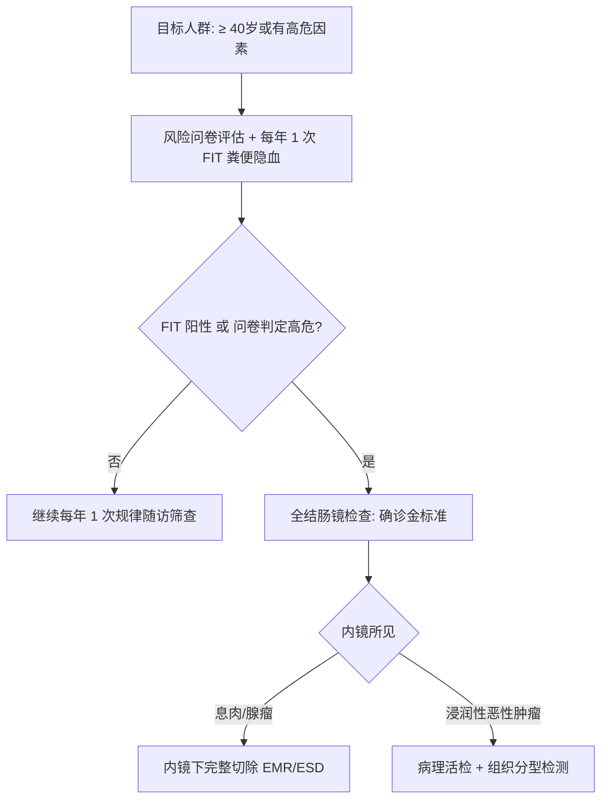

# 结直肠癌高危筛查与直肠 MRI 评估

## 一、 早期筛查路径与高危分层策略
根据国家卫生健康委《中国结直肠癌诊疗规范（2025版）》（[[SRC-NHC-ONC-2025-01]]），我国推荐实行“初筛问卷评估 + 粪便隐血FIT检测”的群体筛查流程：

---

## 二、 直肠癌高分辨率 MRI 结构式评估规范
术前直肠 MRI 薄层平扫与增强检查是直肠癌分期和制定新辅助放化疗决策的核心依据。报告必须标准化明确以下核心指标：

1. **肿瘤与解剖标志物距离**：
   - 肿瘤下极距肛缘及齿状线的距离；
   - 肿瘤上极与腹膜反折的位置关系（腹膜反折以上按结肠癌原则处理，以下按直肠癌原则处理）。
2. **环周切缘（Circumferential Resection Margin, CRM）**：
   - **判定标准**：肿瘤浸润灶、脉管癌栓或转移淋巴结距直肠系膜筋膜（MRF）的最短距离 **≤ 1.0 mm**，判定为 **CRM 阳性**。
   - **临床意义**：CRM 阳性是局部复发的极高危预测指标，必须强制实施术前新辅助放化疗（TNT模式）。
3. **壁外血管侵犯（Extramural Venous Invasion, EMVI）**：
   - MRI 表现为肿瘤浸润并穿破直肠固有肌层，在直肠系膜血管走行区出现肿瘤充盈、血管管径增粗或信号异常；
   - **EMVI 阳性**是远处血行转移（肝、肺转移）的高危独立预测因素。
4. **侧方淋巴结受累**：
   - 髂内及闭孔血管旁淋巴结短径 ≥ 7 mm 或形态不规则/信号混杂提示侧方淋巴结转移。

---

## 三、 关联页面与反向引用
- **疾病实体**: [[结直肠癌]]
- **核心药物**: [[免疫检查点抑制剂]]
- **综合专题**: [[恶性肿瘤转化治疗与MDT决策路径]]
