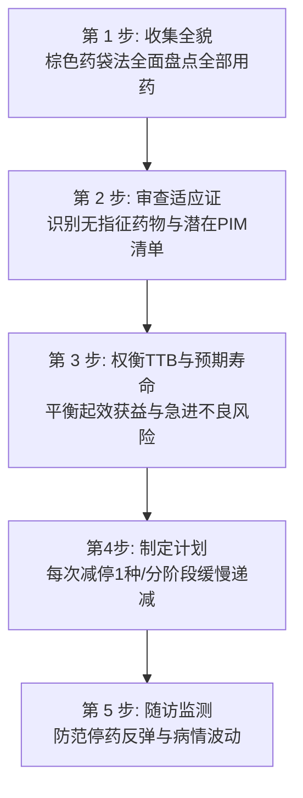

# 老年多重用药筛查与处方精简五步法

## 一、 老年多重用药核心临床切点
根据《基层医疗卫生机构老年人多重用药与慢病共病全科安全管理指南》（[[SRC-CSGP-GERI-2023-02]]）：
- **多重用药（Polypharmacy）**：患者日常同时且长期使用 **≥ 5 种** 药品；
- **过度多重用药（Hyperpolypharmacy）**：同时使用 **≥ 10 种** 药品；
- **危害统计**：当用药种类由 5 种增加至 8 种以上时，药物不良事件发生率从 13% 陡增至 58%，跌倒骨折与认知功能障碍风险成倍增加。

---

## 二、 老年潜在不适当用药（PIM）红线筛查清单

基于中国专家共识及国际 Beers / STOPP 标准，在社区老年人中具有明确高风险的典型 PIM 药物类别：

| 药物大类 | 典型代表药物 | 主要不良风险与危害机制 | 全科减停与替代策略 |
| :--- | :--- | :--- | :--- |
| **苯二氮䓬类镇静药** | 地西泮（安定）、艾司唑仑、氯硝西泮 | 老年半衰期显著延长，蓄积导致白天过度镇静、平衡失调、**跌倒髋部骨折发生率增加 2~3 倍** | 逐步阶梯减量（每周减 25%），换用非药物认知睡眠疗法 |
| **第一代抗组胺药** | 扑尔敏（氯苯那敏）、苯海拉明、赛庚啶 | 强大中枢抗胆碱能毒性，诱发急性尿潴留、便秘、口干、青光眼发作及谵妄 | 换用无抗胆碱活性的第二代外周药物（氯雷他定、西替利嗪） |
| **消化道 PPI 抑酸药** | 长期超疗程（>8~12周）无适应证口服奥美拉唑等 | 胃酸长期受抑导致肠道菌群失调、艰难梭菌性腹泻、微量元素（钙、镁、B12）吸收障碍，加重**骨质疏松性骨折** | 胃黏膜愈合或幽门螺杆菌根除后减半量维持或按需间歇服药 |
| **第一/二代强效磺脲类** | 格列本脲（优降糖） | 代谢产物具有活性且肾脏排泄慢，极易诱发**不可逆脑损伤性致死性低血糖** | **老年人绝对禁用！** 换用二甲双胍、DPP-4i 或 SGLT2i |
| **周围神经血管扩张药** | 桂利嗪、长春西汀、某些中药活血注射液 | 缺乏高级别循证获益证据，增加多药负担与过敏性休克风险 | 终止使用，精简处方清单 |

---

## 三、 处方精简（Deprescribing）临床实施五步法

处方精简不是简单粗暴的“随意停药”，而是在医患充分共识下开展的科学阶梯减药流程：

### 1. 第 1 步：全面收集药品（棕色药袋复查法 Brown-Bag Review）
嘱咐患者将家中目前正在服用的所有西药、中成药、草药、保健品及眼药水装在一个袋子里带到门诊，彻底摸清“患者实际吃什么”而非“病历上开了什么”。

### 2. 第 2 步：逐一识别停药指征与潜在不适当用药
- 排查是否存在适应证已消失的药物（如急性胃炎痊愈后仍服用了半年的 PPI；急性扭伤后服用了数月的 NSAIDs）；
- 排查是否存在处方瀑布诱发的“解药”。

### 3. 第 3 步：综合权衡获益时间（TTB）与患者健康预期寿命
- 评估药物起效获益所需时间（Time-to-Benefit, TTB）。例如强化降脂药预防 1 例心肌梗死平均需要连续服药 3~5 年；
- 对于预期寿命极短（<1年）的高龄极度衰弱或终末期患者，一级预防类药物（如预防性他汀）应优先考虑退出，减轻服药负担。

### 4. 第 4 步：制定分级减量停药计划
- 核心操作法：**每次门诊只减停一种药物！**
- 必须阶梯式渐进减量：特别是降压药、抗抑郁药、镇静安眠药及糖皮质激素，若骤停会导致严重的病情反跳或生理戒断危象。

### 5. 第 5 步：严密追踪监测与应急沟通
- 减量后 1~2 周内安排电话或门诊随访，监测主观症状与生命体征（血压、心率、血糖）。

---

## 四、 关联页面与反向引用
- **权威指南来源**: [[SRC-CSGP-GERI-2023-02]]
- **适应疾病实体**: [[老年多病共存]]
- **综合专题协同**: [[社区老年人多重用药处方重整与处方瀑布阻断]], [[慢病多药联合安全与禁忌规避]]
- **权威组织机构**: [[中华医学会全科医学分会]]
