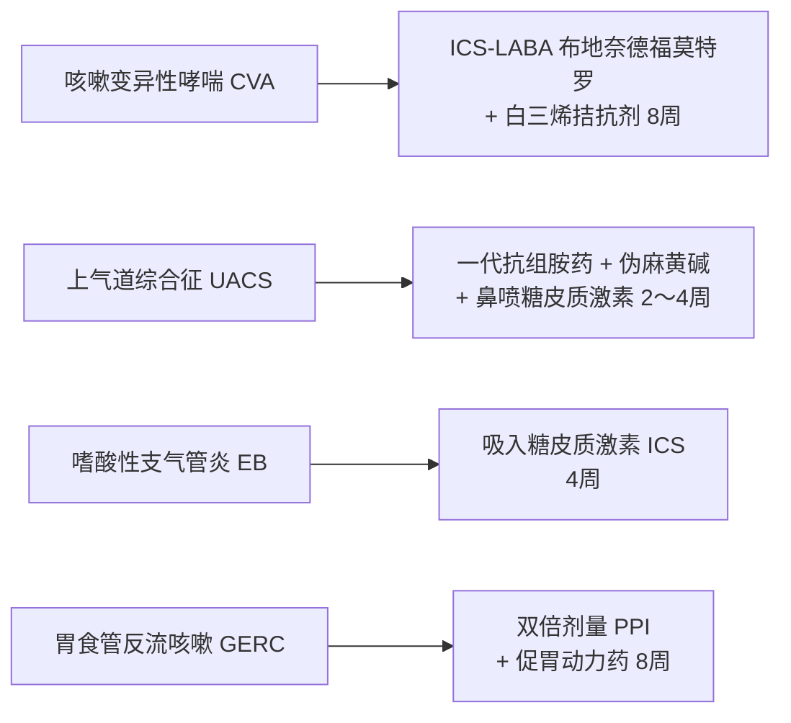

# 慢性咳嗽 (Chronic Cough)

## 一、 实体定义与全科流行病学
慢性咳嗽是指以咳嗽为唯一或主要临床表现，病程持续 **> 8 周**，且**胸部 X 线或 CT 影像学未见明显器质性肺实质病变**的临床综合征。

根据《慢性咳嗽基层诊疗指南》（[[SRC-CSGP-SYMP-2021-02]]），慢性咳嗽占呼吸专科及全科门诊就诊患者的 10%～30%。由于病因隐匿、涉及气道、上消化道、耳鼻咽喉及心血管多个系统，基层医生常误诊为“支气管炎”并反复滥用抗生素，导致迁延不愈。

---

## 二、 诊断要点与解剖学病因排查
排查吸烟及**首要停用 [[RAS抑制剂]] 中的 ACEI 类降压药**后，临床四大核心病因如下：
1. **咳嗽变异性哮喘 (CVA)**：以刺激性干咳为主，夜间及清晨明显，冷空气刺激加剧，支气管舒张剂治疗有效；
2. **上气道咳嗽综合征 (UACS)**：伴慢性鼻炎/鼻窦炎，咽部黏液滴落感，查体见咽后壁淋巴滤泡鹅卵石样增生；
3. **嗜酸粒细胞性支气管炎 (EB)**：无气道高反应性，但诱导痰嗜酸粒细胞 ≥2.5%，吸入激素敏感；
4. **胃食管反流性咳嗽 (GERC)**：反酸烧心或餐后平卧咳嗽加重，反流物刺激食管迷走反射。

详细排查路径见概念专页：[[慢性咳嗽病因解剖学阶梯诊断路径]]。

---

## 三、 规范阶梯治疗与药物匹配

- **严禁滥用抗菌药物**：明确无化脓感染征象者，严禁静脉输注头孢菌素或阿奇霉素；
- 详见药物实体：[[慢性咳嗽阶梯治疗药物]]。

---

## 四、 关联页面与反向引用
- **权威指南来源**: [[SRC-CSGP-SYMP-2021-02]]
- **核心匹配药物**: [[慢性咳嗽阶梯治疗药物]], [[RAS抑制剂]]
- **核心诊疗概念**: [[慢性咳嗽病因解剖学阶梯诊断路径]]
- **综合诊疗专题**: [[基层全科门诊常见未分化主诉排雷与转诊决策]], [[慢病多药联合安全与禁忌规避]]
- **权威组织机构**: [[中华医学会全科医学分会]]
