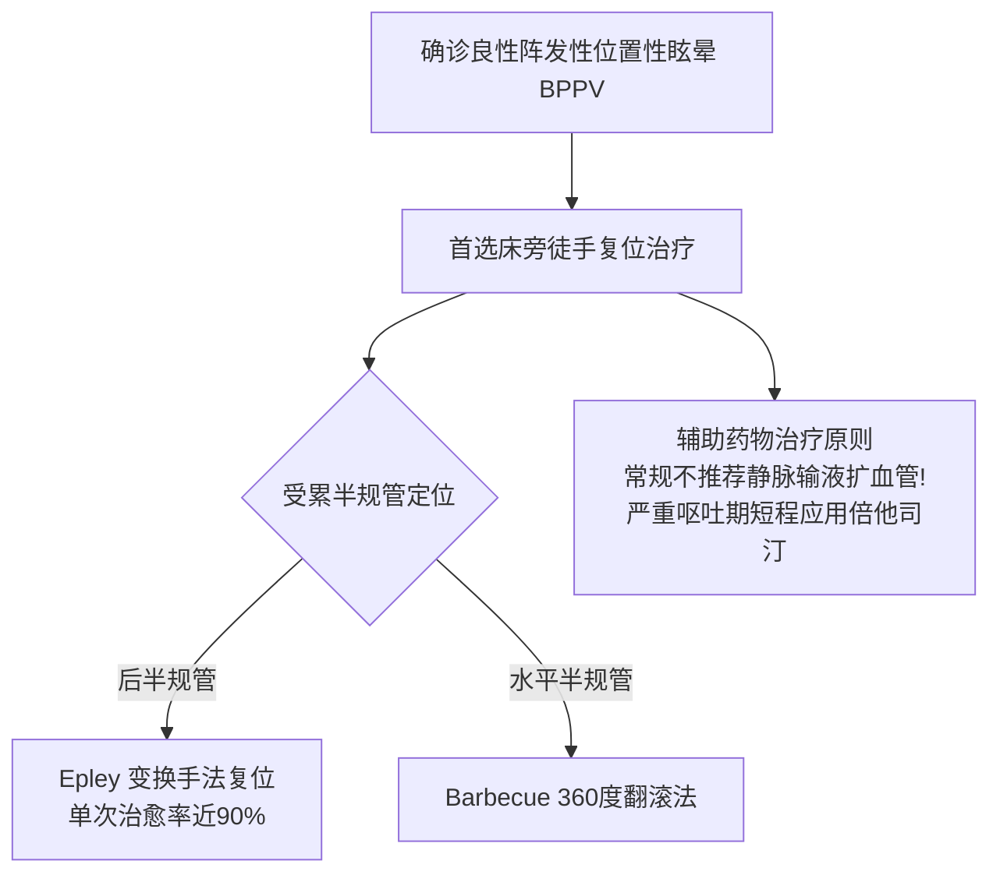

# 良性阵发性位置性眩晕 (BPPV / 耳石症)

## 一、 实体定义与流行病学
良性阵发性位置性眩晕（Benign Paroxysmal Positional Vertigo, BPPV，俗称“耳石症”）是一种源于内耳前庭半规管的原发性外周位置性眩晕疾病。由于椭圆囊耳石膜老化或外伤脱落，致密的碳酸钙微晶（耳石）游离漂浮于半规管内淋巴液中（管结石症）或附着于壶腹嵴顶（嵴顶结石症），当头部空间位置发生改变时，重力驱动耳石移动带动内淋巴流动，异常刺激壶腹嵴毛细胞诱发剧烈旋转性眩晕。

根据《头晕/眩晕基层诊疗指南》（[[SRC-CSGP-SYMP-2020-01]]），BPPV 占全科门诊接诊全部前庭性眩晕的 **40% 以上**，年发病率达 2.4%，女性多于男性，中老年人高发。

---

## 二、 临床特征与分型激发试验
### 1. 典型临床特征三要素：
- **位置依赖**：眩晕发作绝对由头位相对于重力方向的改变瞬间触发（如床上翻身、坐起、仰头、弯腰）；
- **发作短暂**：剧烈旋转感通常持续 **数秒至1分钟以内（多 <30秒）**，头位保持固定后眩晕与眼震迅速缓解；
- **伴随症状**：常伴严重恶心、干呕、心慌出汗，但**不伴有耳鸣、听力下降及神经定位体征**。

### 2. 诊断激发试验金标准：
- **后半规管 BPPV（占 85%~90%）**：**Dix-Hallpike 试验**诱发患侧眼球上跳性（Upbeating）伴向地性旋转眼震，潜伏期 2~5 秒，眼震持续通常 <1 分钟且具有易疲劳性；
- **水平半规管 BPPV（占 10%~15%）**：**仰卧翻头试验（Roll Test）**诱发双侧水平向地性或背地性眼震。

---

## 三、 治疗原则：手法复位为主，规避滥用输液

- **首选金标准治疗**：**耳石手法复位（Canalith Repositioning Procedure, CRP）**。后半规管首选 **Epley 手法**，水平半规管首选 **Barbecue 翻滚手法**。通过徒手连续改变头位，借助重力促使游离耳石自然落回无刺激反应的椭圆囊内，单次复位有效率高达 80%~90%；
- **药物使用原则**：详见药物实体 [[前庭抑制剂与耳石复位手法]]。复位成功后无需长期用药，坚决杜绝基层滥用盲目输液扩血管。

---

## 四、 关联页面与反向引用
- **权威指南来源**: [[SRC-CSGP-SYMP-2020-01]]
- **核心疗法与药物**: [[前庭抑制剂与耳石复位手法]]
- **核心诊疗概念**: [[头晕眩晕HINTS三步床旁检查与红旗征]]
- **综合诊疗专题**: [[基层全科门诊常见未分化主诉排雷与转诊决策]]
- **权威组织机构**: [[中华医学会全科医学分会]]
