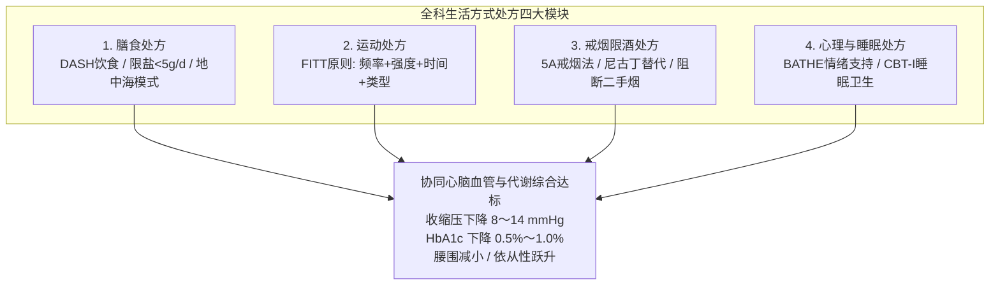

# 以家庭为单位慢病连续性管理与生活方式处方

## 一、 临床背景：从“个人单病管理”走向“以家庭为单位的生态健康”
在社区基层临床中，高血压、糖尿病、肥胖及心血管疾病往往呈现高度的**家庭聚集性**。共同的饮食偏好（高盐重油）、缺乏运动的共同家庭生活习惯、家庭人际压力以及遗传易感性，使得单靠在门诊给个体开药无法从根源上控制慢性病。

根据国家卫健委及中华医学会全科医学分会共识（[[SRC-CSGP-GP-2023-01]], [[SRC-NHC-PRIM-2022-01]]），全科医生必须将接诊单位从“孤立的个人”升维为“**以家庭为单位（Family-Oriented Care）**”，依托家庭医生签约服务体系，提供长期连续的综合性慢病照护与可量化执行的“生活方式处方”。

---

## 二、 家庭评估工具与家系图 (Genogram) 的临床运用

全科医生在建立居民健康档案时，常规绘制**三代家系图（Family Genogram）**，直观呈现：
1. **生物遗传谱系**：早发冠心病史、高血压、糖尿病及恶性肿瘤在家族成员中的分布；
2. **家庭结构与代际关系**：核心家庭、空巢老人、独居状态；
3. **家庭生活周期（Family Life Cycle）应激节点**：新婚期、抚幼期、空巢期、丧偶期等重大生活转型阶段往往是躯体疾病诱发或加重的高危窗口期。

---

## 三、 全科“生活方式处方（Lifestyle Prescription）”量化落地规范

单纯对患者交代“注意清淡饮食、多活动”等模糊建议没有任何临床干预效力。全科生活方式处方必须具备**可衡量性、可执行性与可追踪性**：

### 1. 膳食处方（以高血压与代谢病为例）：
- **食盐摄入限量**：每日烹调用盐严格控制在 **< 5 g**（约 1 平啤酒瓶盖量），减少酱油、咸菜及加工肉制品；配合低钠富钾盐（肾功能严重不全者禁用）；
- **DASH 降压饮食模式**：每日保证摄入新鲜蔬菜 400～500 g、水果 200～350 g、全谷物及杂豆 50～150 g，减少红肉，增加低脂乳制品；长期坚持可使收缩压独立下降 **8 ～ 14 mmHg**！

### 2. 运动处方（遵循 FITT 国际规范原则）：
- **频率 (Frequency)**：每周至少 **5 天**；
- **强度 (Intensity)**：中等强度有氧运动（运动中心率达到 `[220 - 年龄] × (60% ～ 70%)`，或“运动中微出汗、能说话但不能唱歌”）；
- **时间 (Time)**：每次坚持 **30 ～ 45 分钟**，每周累计达到 **150 分钟以上**；
- **类型 (Type)**：快走、慢跑、太极拳、游泳、骑自行车；每周辅以 2 次核心抗阻肌力训练。

### 3. 戒烟处方（推行 5A 戒烟干预流程）：
- 询问（Ask）-> 建议（Advise）-> 评估（Assess）-> 帮助（Assist）-> 随访（Arrange）。

---

## 四、 签约家庭医生慢病连续性随访闭环

根据国家基本公共卫生服务规范：
1. **原发性高血压规范管理**：每年至少提供 **4 次面对面随访**，监测诊室与家庭自测血压，指导阶梯用药；每年 1 次全面健康体检（查心电图、尿微量白蛋白、血脂及血糖）；
2. **2型糖尿病规范管理**：每年至少提供 **4 次空腹血糖检测与面对面随访**，每年筛查足背动脉搏动与糖尿病足、眼底病变及尿 UACR；
3. **全科 SOAP 病历全程沉淀**：每次随访详实记录 SOAP 病历（详见概念专页：[[全科SOAP病历书写规范]]），通过医患契约建立长达数年乃至数十年的终身健康伙伴关系。

---

## 五、 关联页面与反向引用
- **权威指南来源**: [[SRC-CSGP-GP-2023-01]], [[SRC-NHC-PRIM-2022-01]], [[SRC-CMA-CARD-2024-01]], [[SRC-CDS-ENDO-2024-01]]
- **核心疾病实体**: [[原发性高血压]], [[2型糖尿病]], [[慢性阻塞性肺疾病]], [[老年多病共存]]
- **核心规范概念**: [[全科以人为中心接诊与BATHE问诊技巧]], [[全科SOAP病历书写规范]]
- **全科医学组织**: [[中华医学会全科医学分会]], [[国家卫生健康委员会]]
