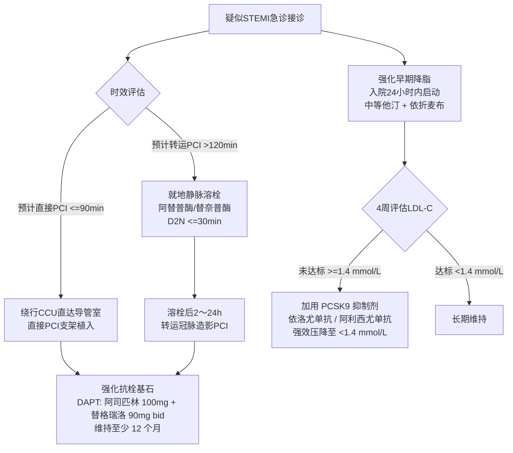

# 冠心病与急性心肌梗死抗栓联合降脂全景管理

## 一、 临床背景：从斑块破裂到急性闭塞的病理链条
冠状动脉粥样硬化斑块破裂并发急性血栓形成，是导致 [[急性ST段抬高型心肌梗死]] 与急性冠脉综合征（ACS）的直接病因。这一急性危重事件的底层驱动力，正是长期的致动脉粥样硬化脂蛋白（LDL-C）在血管内皮的潴留与炎性浸润（[[动脉粥样硬化性心血管疾病]]）。

现代心血管临床治疗确立了“**再灌注急救 -> 强化双抗抗栓 -> 极早期联合降脂稳定斑块 -> 终身二级预防**”的连续救治闭环。

---

## 二、 救治时空全景管理路径图

---

## 三、 跨指南协同抗栓与降脂方案矩阵

| 救治阶段 | 抗栓策略与药物用量 | 降脂策略与靶标控制 | 对应指南条款支持 |
| :--- | :--- | :--- | :--- |
| **超早期急救** （0 ～ 24小时） | • 立即嚼服阿司匹林 300 mg • 替格瑞洛 180 mg 顿服负荷 • PCI 术中普通肝素抗凝 | • 无论基线血脂高低，入院 24 小时内启动常用中等强度他汀（阿托伐他汀 20mg / 瑞舒伐他汀 10mg） • 预计极高基线者可院内直接联合 PCSK9 抑制剂 | [[SRC-CMA-CARD-2019-03]] [[SRC-CMA-CARD-2023-03]] |
| **急性期稳定** （出院前） | • 阿司匹林 100 mg qd • 替格瑞洛 90 mg bid • 溃疡高危联合 PPI 护胃 | • 中等他汀 + 依折麦布 10 mg qd 口服双联 • 监测 ALT/AST 及肌酸激酶（CK） | [[替格瑞洛与阿司匹林]] [[他汀类与PCSK9抑制剂]] |
| **院外强化期** （1 ～ 12个月） | • 双抗治疗（DAPT）严格维持至少 12 个月 • 评估出血风险 | • **超高危严格达标**：**LDL-C < 1.4 mmol/L 且较基线降幅 ≥ 50%** • 未达标者皮下注射 PCSK9 抑制剂 | [[ASCVD危险分层与LDL-C控制靶标]] |
| **长期二级预防** （> 12个月） | • 阿司匹林 100 mg qd 单药终生维持 • 不耐受者换用氯吡格雷 75 mg qd | • 终身维持中等他汀联合降脂 • 保持 LDL-C 长期稳定达标 | [[动脉粥样硬化性心血管疾病]] |

---

## 四、 药物联合冲突与临床警戒
1. **抗栓与消化道出血矛盾**：替格瑞洛联合阿司匹林胃肠出血风险显著，必须常规筛查 [[幽门螺杆菌感染]]，若为活动性溃疡应首选根除幽门螺杆菌（详见专题：[[消化道溃疡幽门螺杆菌根除与心脑血管抗栓胃黏膜保护]]）；
2. **中国人群大剂量他汀肌病警戒**：严禁盲目套用国外“大剂量阿托伐他汀 80mg”方案，中国人群应坚持“**中等强度他汀为基础，早期联合依折麦布与 PCSK9 抑制剂**”，既保障降脂达标率，又规避严重横纹肌溶解与肝酶损毁（详见 [[慢病多药联合安全与禁忌规避]]）。

---

## 五、 关联页面与反向引用
- **权威指南来源**: [[SRC-CMA-CARD-2019-03]], [[SRC-CMA-CARD-2023-03]]
- **核心疾病实体**: [[急性ST段抬高型心肌梗死]], [[动脉粥样硬化性心血管疾病]]
- **核心药物实体**: [[替格瑞洛与阿司匹林]], [[他汀类与PCSK9抑制剂]], [[阿替普酶与替奈普酶]], [[ARNI]]
- **核心诊疗概念**: [[STEMI急诊绿色通道与直接PCI时效指标]], [[ASCVD危险分层与LDL-C控制靶标]]
- **交叉专题链接**: [[消化道溃疡幽门螺杆菌根除与心脑血管抗栓胃黏膜保护]], [[心脑血管与代谢性疾病共病管理]]
