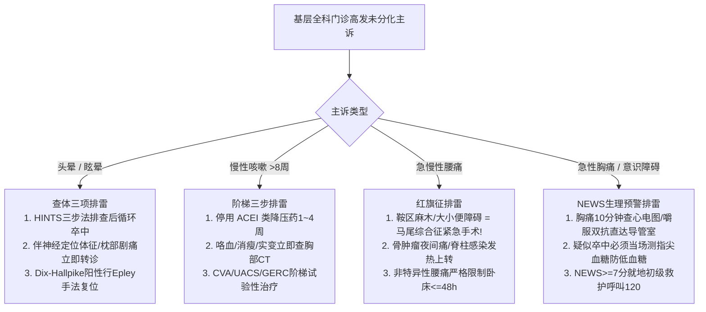

# 基层全科门诊常见未分化主诉排雷与转诊决策

## 一、 全科临床思维核心：未分化疾病与“排雷第一”法则
专科医疗多是在疾病经过初步分化、进入器质性病理阶段后接诊；而基层全科门诊直面的是海量处于疾病极早期、症状模糊且边界不清的**“未分化主诉（Undifferentiated Complaints）”**。

根据国家卫健委及中华医学会全科医学指南（[[SRC-NHC-PRIM-2022-01]], [[SRC-CSGP-SYMP-2020-01]], [[SRC-CSGP-SYMP-2021-02]], [[SRC-CSGP-MSK-2023-01]]），全科医生必须秉持两大临床思维基石：
1. **概率思维（Common things are common）**：优先考虑常见病、多发病（如耳石症、CVA、非特异性腰痛），规避过度医疗；
2. **排雷思维（Rule out the worst first）**：在处置良性病前，必须系统筛查**“红旗征（Red Flags）”**，以零容忍态度坚决排除致命性急重症（小脑卒中、马尾综合征、急性心肌梗死）。

---

## 二、 全科门诊四大高发未分化主诉排雷决策图谱

---

## 三、 四大主诉全科鉴别与转诊时效对照表

| 主诉与系统 | 常见良性病因 (优先处理) | 致命红旗征 (必须即刻转诊) | 基层推荐现场处置技术 | 对应指南参考 |
| :--- | :--- | :--- | :--- | :--- |
| **头晕 / 眩晕** | [[良性阵发性位置性眩晕]]（BPPV耳石症，短暂旋转） | • HINTS提示中枢性（HIT正常/垂直偏斜） • 复视、言语不清、面瘫、不能站立行走 • 突发后枕部剧痛（后循环小脑/脑干卒中） | 床旁 Dix-Hallpike 激发试验 + **Epley 手法复位**；严禁盲目长期输液 | [[SRC-CSGP-SYMP-2020-01]] [[头晕眩晕HINTS三步床旁检查与红旗征]] |
| **慢性咳嗽** | 咳嗽变异性哮喘 (CVA)、上气道综合征 (UACS) | • 咯血或痰中带血 • 进行性消瘦（半年体重降>5%） • 进行性呼吸困难、杵状指（肺癌/结核） | **首要停用 ACEI 降压药**；试验性应用 ICS-LABA（布地奈德福莫特罗）；严禁滥用抗菌药 | [[SRC-CSGP-SYMP-2021-02]] [[慢性咳嗽病因解剖学阶梯诊断路径]] |
| **急慢性腰痛** | [[非特异性腰痛]]（NLBP，占85%~90%） | • **鞍区感觉丧失（会阴部麻木）** • **急性大小便失禁或尿潴留（马尾综合征）** • 肿瘤骨转移（夜间剧痛）、脊柱感染发热 | 明确告知**卧床严禁超过 48 小时**；短期选择性 COX-2 抑制剂（塞来昔布 1~2周）+ 核心肌群锻炼 | [[SRC-CSGP-MSK-2023-01]] [[腰痛红旗征排查与NEWS早期预警评分]] |
| **胸痛 / 急症** | 肋间神经痛、心脏神经官能症、胃食管反流 | • 持续胸骨后压榨性剧痛伴大汗出冷汗 • 突发面瘫偏瘫（FAST原则） • **NEWS 早期预警评分 ≥ 7 分** | **胸痛**：心电图 + 嚼服阿司匹林300mg+替格瑞洛180mg； **卒中**：**现场必测指尖微量血糖**防低血糖脑病 | [[SRC-NHC-PRIM-2022-01]] [[STEMI急诊绿色通道与直接PCI时效指标]] |

---

## 四、 基层医疗机构转诊安全交接闭环

1. **上转交接要求（转得快、接得稳）**：
   - 拨打 120 呼叫急救车，严禁让潜在危重患者自行步行或乘私家车转院；
   - 随车携带基层初查心电图、血糖、给药时间记录（如阿司匹林、肾上腺素给药剂量）；
2. **下转回流机制（接得住、管得好）**：
   - 上级医院急性期救治平稳后转回基层社区；
   - 社区全科家庭医生团队在 **3 个工作日内**完成对接，提供连续性慢病与康复健康管理。

---

## 五、 关联页面与反向引用
- **权威指南来源**: [[SRC-CSGP-SYMP-2020-01]], [[SRC-CSGP-SYMP-2021-02]], [[SRC-CSGP-MSK-2023-01]], [[SRC-NHC-PRIM-2022-01]]
- **核心疾病实体**: [[良性阵发性位置性眩晕]], [[慢性咳嗽]], [[非特异性腰痛]], [[急性缺血性脑卒中]], [[急性ST段抬高型心肌梗死]]
- **核心药物与技术**: [[前庭抑制剂与耳石复位手法]], [[慢性咳嗽阶梯治疗药物]], [[替格瑞洛与阿司匹林]]
- **核心规范概念**: [[头晕眩晕HINTS三步床旁检查与红旗征]], [[慢性咳嗽病因解剖学阶梯诊断路径]], [[腰痛红旗征排查与NEWS早期预警评分]], [[STEMI急诊绿色通道与直接PCI时效指标]]
- **全科医学组织**: [[中华医学会全科医学分会]], [[国家卫生健康委员会]]
