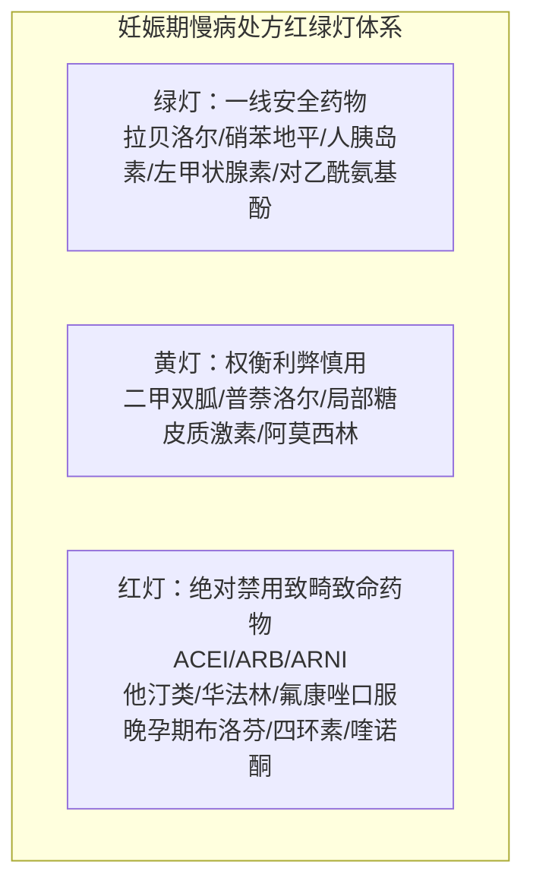

# 妊娠与哺乳期慢病母婴安全多学科管理

## 一、 临床背景：高龄妊娠与慢病早发下的母婴双重挑战
随着我国生育政策调整与生育年龄后延，合并高血压、糖尿病、甲状腺功能减退及慢性疼痛的孕产妇比例急剧升高。
妊娠期母体处于独特的血流动力学高排低阻、肾小球滤过率代偿性增高（升高 50%）及激素环境巨变中；同时，胎盘屏障的通透性决定了外源性药物可能直接致畸或破坏胎儿靶器官发育。

临床处方必须恪守：**“保障母体生命体征稳定”与“杜绝胎儿器官致畸与胎死宫内”并重的绝对红线**。

---

## 二、 妊娠期慢病多学科阶梯安全用药红绿灯矩阵

### 1. 妊娠合并高血压与子痫前期
- **降压目标**: 控制在 **130～140 / 80～90 mmHg**；**严禁舒张压 < 80 mmHg**（防止胎盘血液灌注不足致胎儿窘迫）；
- **推荐安全药物**:
  - [[盐酸拉贝洛尔片]]：α/β 受体阻滞剂，一线首选，不减胎盘血流，常用 100mg bid～tid；
  - 硝苯地平缓释片/控释片：二氢吡啶 CCB，起效平稳，改善血管阻力；
- **绝对致畸禁忌 (红色阻断)**:
  - **ACEI / ARB / ARNI**：卡托普利、缬沙坦、沙库巴曲缬沙坦等。孕中期、晚期使用可致**胎儿肾小管发育不良、羊水过少、肺发育不良、颅骨骨化不全及胎死宫内**！
  - **利尿剂**：氢氯噻嗪等常规降压避免使用（血液浓缩、血容量减少加重胎盘缺血）。

### 2. 妊娠期高血糖与糖尿病 (GDM)
- **血糖控制目标**: 孕期空腹血糖 < 5.3 mmol/L，餐后 1 小时 < 7.8 mmol/L，餐后 2 小时 < 6.7 mmol/L；
- **首选干预**: 医学营养治疗（MNT）与轻度餐后散步运动；
- **药物首选**: **胰岛素**（生物合成人胰岛素、门冬胰岛素、地特胰岛素），不通过胎盘屏障，安全降糖金标准；
- **禁忌规避**: 禁用口服磺脲类促泌剂（格列本脲可穿透胎盘引起新生儿严重低血糖）及 SGLT2 抑制剂。

### 3. 妊娠合并甲状腺功能减退
- **治疗基石**: [[左甲状腺素钠片]]（优甲乐）。外源性左甲状腺素与内源性甲状腺素完全同质，是保障胎儿中枢神经系统与智力发育的关键；
- **控制靶标**: 孕早期 TSH < 2.5 mIU/L，孕中晚期 < 3.0 mIU/L；
- **服药细节**: 清晨空腹顿服，与产检常规开具的补钙剂（碳酸钙）及补铁剂（硫酸亚铁）**必须间隔 4 小时以上**，以防胃肠道金属离子络合失效。

### 4. 妊娠期退热止痛与抗感染
- **解热镇痛**:
  - **首选对乙酰氨基酚**：全孕期解热镇痛一线首选，无致畸风险；
  - **孕 20 周后慎用、孕 28 周后绝对禁用布洛芬等 NSAIDs**：NSAIDs 可抑制前列腺素合成，诱发胎儿**动脉导管过早闭合**，导致进行性肺动脉高压及羊水过少。
- **抗生素选择**:
  - 安全选用：青霉素类（阿莫西林）、头孢菌素类、大环内酯类（阿奇霉素）；
  - **绝对禁用**：喹诺酮类（软骨毒性）、四环素类（牙齿黄染与骨发育迟缓）、氨基糖苷类（前庭耳毒性与不可逆性耳聋）。

---

## 三、 哺乳期用药母乳转运安全原则 (Hale 分级)

1. **给药时间技巧**: 指导产妇在“刚刚哺乳结束之后”立即服药，或选择宝宝睡眠最长的一段间隔前服药，避开乳汁中血药峰浓度；
2. **警惕中枢阿片类**: 哺乳期严禁使用可待因等强阿片类止痛药（超快代谢型产妇乳汁中吗啡浓度骤升，导致婴儿阿片过量猝死）；
3. **退热首选**: 对乙酰氨基酚或布洛芬，在乳汁中排泄量极微（相对婴儿剂量 < 1%），哺乳期均属 L1/L2 级安全用药。

---

## 四、 指南依据与溯源网络
- 循证指南: [[SRC-CMA-GYN-2020-02]], [[SRC-CMA-GYN-2022-01]], [[SRC-CMA-ENDO-2017-01]]
- 关联疾病: [[妊娠期高血压疾病]], [[2型糖尿病]], [[甲状腺功能减退症]]
- 诊疗规范: [[妊娠期用药风险分级与母婴安全禁忌]], [[75g葡萄糖耐量试验OGTT与GDM诊断切点]]
- 临床协议: [[PROT-PIH-036 门诊妊娠期高血压与子痫前期早期识别与安全降压方案|PROT-PIH-036]], [[PROT-GDM-037 妊娠期糖尿病门诊生活方式干预与胰岛素精准控糖方案|PROT-GDM-037]]
