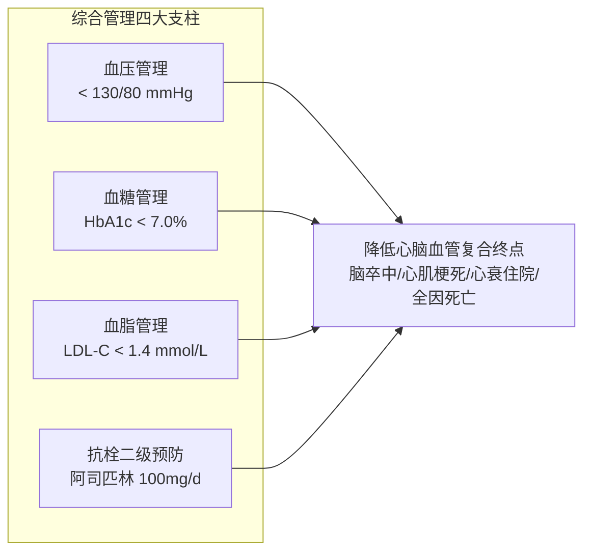

# 心脑血管与代谢性疾病共病管理综合指南

## 一、 临床背景：心脑代谢共病综合征（Cardio-Renal-Metabolic Syndrome）
在我国临床实践中，[[原发性高血压]]、[[2型糖尿病]]、血脂异常、动脉粥样硬化性心血管病（冠心病、[[急性缺血性脑卒中]]）以及 [[慢性心力衰竭]] 极少孤立存在。超过 60% 的糖尿病患者合并高血压，高血压合并糖尿病患者的心血管事件风险呈数倍几何级增长。中国临床诊疗已由单纯的“单病单治”彻底转变为“以器官保护为导向的心脑代谢全景共病综合管理”。

---

## 二、 跨指南协同达标与目标管理矩阵

| 控制维度 | 单纯患者目标 | 伴心血管高危 / 共病患者推荐目标 | 对应指南支持 |
| :--- | :--- | :--- | :--- |
| **血压目标** | < 140/90 mmHg | **< 130/80 mmHg**（耐受良好） | [[SRC-CMA-CARD-2024-01]] |
| **血糖目标** | HbA1c < 7.0% | **HbA1c < 7.0%**（兼顾低血糖风险，高龄放宽至 <8.0%） | [[SRC-CDS-ENDO-2024-01]] |
| **血脂目标 (LDL-C)** | < 2.6 mmol/L | **< 1.4 mmol/L 且降幅 ≥ 50%**（合并心脑血管疾病极高危） | [[SRC-CMA-CARD-2023-03]] |
| **抗栓策略** | 无ASCVD不常规抗血小板 | 确诊冠心病/卒中后长期口服阿司匹林 100 mg/d | [[SRC-CMA-NEUR-2023-01]] |

---

## 三、 药物协同选择推荐路径

### 1. 糖尿病合并高血压的降压降糖优选：
- **降压首选**：**[[RAS抑制剂]]（ACEI 或 ARB）** 或 **[[ARNI]]**。扩张出球小动脉，改善胰岛素抵抗，显著减少蛋白尿并延缓肾损害。第二联优先合用 **[[钙通道阻滞剂]]（CCB）**。
- **降糖首选**：**[[二甲双胍]]** 为基础；优先联合 **[[SGLT2抑制剂]]**（达格列净/恩格列净）与 **[[GLP-1受体激动剂]]**（司美格鲁肽）。两者在降糖同时具有轻度降压（收缩压降2～4 mmHg）、减重及降低白蛋白尿的协同获益。

### 2. 糖尿病合并心力衰竭（HFrEF/HFpEF）的跨界统筹：
- **降糖降衰双重基石**：**[[SGLT2抑制剂]]**（I类推荐，A级证据）。不论糖尿病是否达标，均必须作为抗心衰基础用药。
- **心衰用药配套**：**[[ARNI]]**（沙库巴曲缬沙坦）替代传统 ACEI，联合 **[[β受体阻滞剂]]**（比索洛尔/美托洛尔缓释片）和 MRA 螺内酯。
- **慎用/禁用降糖药**：**噻唑烷二酮类（吡格列酮）心衰患者绝对禁用**（可导致水钠潴留恶化心衰）。

### 3. 高血压合并缺血性脑卒中二级预防：
- 急性期平稳后将血压平稳控制于 < 130/80 mmHg；
- 伴高危 TIA 或轻型卒中 24 小时内启动阿司匹林加氯吡格雷双抗 21 天，后续转为单抗长期维持；
- 强化他汀降脂（目标 LDL-C < 1.4 mmol/L，详见 [[他汀类与PCSK9抑制剂]]）。

---

## 四、 关联页面与反向引用
- **疾病实体**: [[原发性高血压]], [[2型糖尿病]], [[慢性心力衰竭]], [[急性缺血性脑卒中]], [[动脉粥样硬化性心血管疾病]]
- **核心用药**: [[二甲双胍]], [[SGLT2抑制剂]], [[GLP-1受体激动剂]], [[RAS抑制剂]], [[ARNI]], [[钙通道阻滞剂]], [[β受体阻滞剂]], [[他汀类与PCSK9抑制剂]]
- **用药安全**: [[慢病多药联合安全与禁忌规避]]
