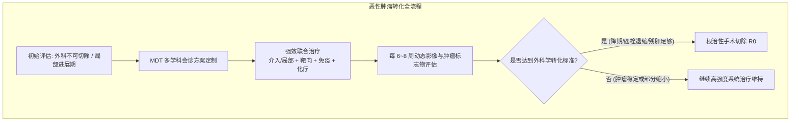

# 恶性肿瘤转化治疗与多学科综合诊疗 (MDT) 决策路径

## 一、 现代肿瘤学核心战略转变：从“不可切除”到“根治性转化”
在我国过去恶性肿瘤诊疗中，确诊为局部进展期、大血管侵犯或寡转移（如肝转移）的晚期患者往往直接判定为无法手术，仅接受姑息治疗。随着靶向药物、[[免疫检查点抑制剂]] 以及局部介入/放疗技术的飞跃，国家卫生健康委在多部权威恶性肿瘤指南（[[SRC-NHC-ONC-2024-01]], [[SRC-NHC-ONC-2022-02]], [[SRC-NHC-ONC-2025-01]]）中均将 **“转化治疗（Conversion Therapy）”** 与 **“多学科诊疗（MDT）”** 确立为核心战略路径。

---

## 二、 三大高发肿瘤转化治疗决策对比

### 1. 原发性肝癌（CNLC IIIa期 / 巨大肝癌转化）：
- **目标人群**：合并门静脉主干/分支癌栓（IIIa期）、病灶巨大预留残肝体积不足（FLR不足）、或多发病灶（IIb期）。
- **转化方案**：
  - 局部与系统强效联合：**肝动脉灌注化疗（HAIC）/ TACE 联合 “靶向+免疫”双药方案（如信迪利单抗+贝伐类似物、卡瑞利珠单抗+阿帕替尼、仑伐替尼）**。
  - 门静脉癌栓退缩且肝功能恢复后，实施根治性切除术，5年生存率实现数倍提升。

### 2. 结直肠癌肝转移（CRLM 转化）：
- **目标人群**：初始技术不可切除的结直肠癌同时性或异时性肝转移。
- **转化方案**：
  - 分子检测先行：检测 RAS、BRAF 及 MMR 状态。
  - RAS野生型首选 **化疗（FOLFOX/FOLFIRI）联合抗EGFR单抗（西妥昔单抗）**；RAS突变型联合抗VEGF单抗（贝伐珠单抗）。
  - 转化成功后行 **结直肠原发灶与肝转移灶同期或分期二期根治性手术切除**。

### 3. 非小细胞肺癌（局部进展期新辅助转化）：
- **目标人群**：可切除或潜在可切除 IIA~IIIA 期 NSCLC。
- **转化方案**：
  - 驱动基因阴性者：**术前新辅助 PD-1 抑制剂联合含铂双药化疗 2~3 周期**；
  - 带来高达 20%~25% 的病理完全缓解率（pCR），显著提高根治性 R0 切除率并延长无事件生存期（EFS）。

---

## 三、 MDT 多学科团队的标准运作闭环
多学科综合诊疗模式（Multi-Disciplinary Team, MDT）要求以下专科联合会诊形成一致意见：
1. **外科专科**（肝胆外科/胸外科/结直肠外科）：评估病灶外科学可切除性及手术边界；
2. **肿瘤内科**：根据基因突变谱制定高效转化抗肿瘤药物方案；
3. **介入科与放疗科**：配合精准局部杀伤手段（TACE、HAIC、SBRT立体定向放疗）；
4. **影像诊断科与病理科**：精确提供疗效评价（RECIST 1.1 与 mRECIST）与生物标志物解读。

---

## 四、 关联页面与反向引用
- **疾病实体**: [[原发性肝癌]], [[结直肠癌]], [[非小细胞肺癌]]
- **核心药物**: [[免疫检查点抑制剂]], [[第三代EGFR-TKI]]
- **核心概念**: [[CNLC中国肝癌临床分期]], [[肺癌TNM分期与驱动基因谱]], [[结直肠癌高危筛查与直肠MRI评估]]
