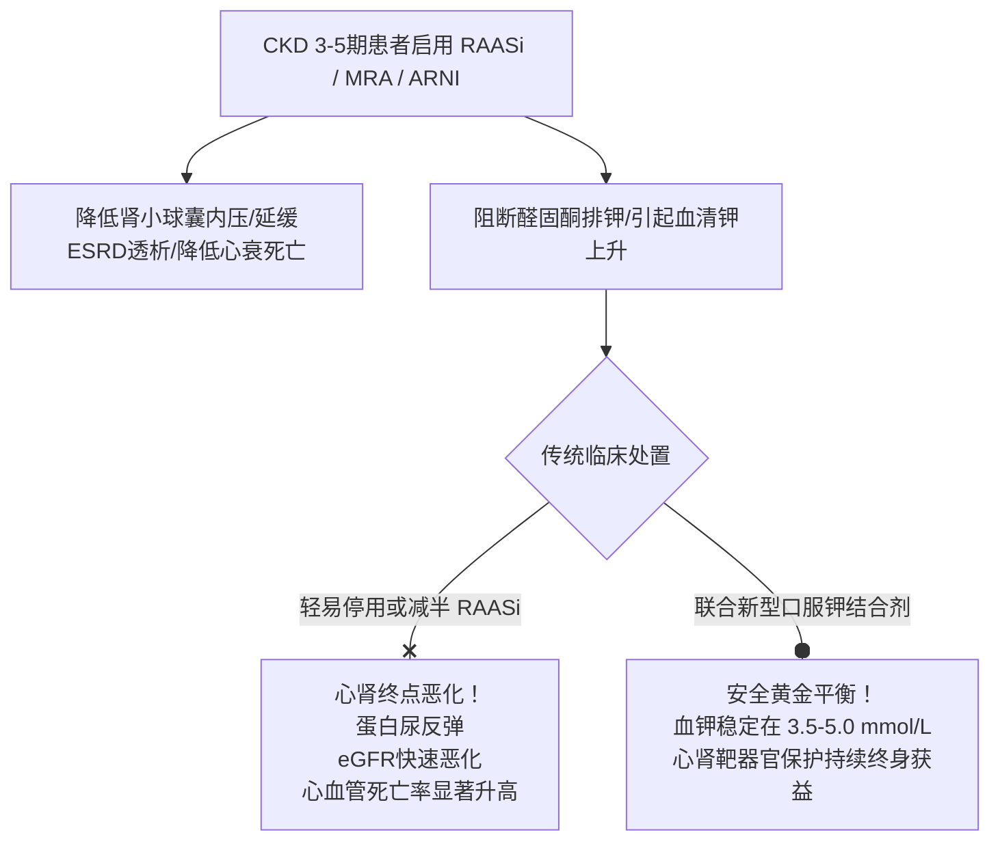

# 慢性肾脏病非透析期高钾血症与心肾保护全景管理

## 一、 临床矛盾：心肾保护获益 vs 致死性高钾血症风险
慢性肾脏病（CKD 3～5 期非透析）患者由于肾单位严重毁损、肾小管排钾功能减退，常伴有内源性酸中毒与排钾受限。
然而，在心肾共病现代治疗中，**肾素-血管紧张素系统抑制剂（ACEI/ARB）**、**血管紧张素受体脑啡肽酶抑制剂（ARNI）**及**非甾体盐皮质激素受体拮抗剂（非奈利酮）**是延缓肾小球滤过率下降、减少蛋白尿、降低心衰再住院及心血管死亡的核心基石。

因此，现代肾脏病学指南明确提出：**绝不能因高钾血症而过早停用或大幅减量心肾保护基石药物，而应通过新型口服钾结合剂长期维持血钾正常，为 RAASi 全量保护保驾护航！**

---

## 二、 高钾血症分级标准与临床决策切点

依据《中国慢性肾脏病早期筛查、诊断及治疗临床实践指南（2024）》（[[SRC-CMA-NEPH-2024-01]]），血清钾（K+）分级及应对路径如下：

| 血钾浓度区间 | 临床分级 | 临床风险特征 | 核心应对策略与用药指引 |
| :--- | :--- | :--- | :--- |
| **3.5 ～ 5.0 mmol/L** | **正常血钾区间** | 最理想靶标区间 | 维持当前心肾保护方案（RAASi / SGLT2i），常规低钾饮食指导 |
| **5.1 ～ 5.5 mmol/L** | **轻度高钾血症** | 多无主观症状，心电图多正常 | **不停用 RAASi**；低钾饮食；启用新型钾结合剂（[[环硅酸锆钠散]] 5g qd）；排查保钾药物 |
| **5.6 ～ 5.9 mmol/L** | **中度高钾血症** | 出现四肢发麻无力，偶见T波高尖 | RAASi **减半或暂缓**；环硅酸锆钠散 5g bid～tid 强化排钾；纠正酸中毒；3天复查 |
| **≥ 6.0 mmol/L** | **重度/危急高钾血症** | 恶性心律失常、室颤、心脏骤停 | **停用所有保钾药**；立即转急诊静脉补钙膜稳定+胰岛素促内流；必要时急诊血液透析 |

---

## 三、 口服新型降钾药物临床药学特性对比

传统阳离子交换树脂降钾速度慢且伴有肠坏死风险，新型高选择性钾捕获剂全面重塑了临床管理路径：

| 药物名称 | 作用机制与结合部位 | 起效时间 | 常用剂量与用法 | 安全性与特别注意事项 |
| :--- | :--- | :--- | :--- | :--- |
| **[[环硅酸锆钠散]]** (Lokelma) | 高选择性无机晶格，在整个胃肠道特异捕获钾离子置换氢和钠 | **1 小时起效**，平均 2.2 小时血钾达标 | 起始：5g tid (服1～2天)；维持：5g qd 或隔日5g | 高选择性不结合钙镁；含钠负荷（严重水肿心衰注意监测）；**与其他口服药必须间隔 2 小时** |
| **聚苯乙烯磺酸钙散** (CPS) | 钙-钾阳离子交换树脂，在结肠部位释放钙结合钾排出体外 | 2 ～ 4 小时 | 每次 15～30g，每日 2～3 次温水调服 | 不引起钠负荷；易致便秘（防粪便嵌顿与肠梗阻）；口感较差，依从性稍低 |
| **碳酸氢钠片** | 碱化体液，促进细胞外钾转移至细胞内 | 慢速 | 每次 0.5～1.0g tid 餐后服 | 适用于合并轻中度代酸（CO2-CP < 22 mmol/L）者；充血性心力衰竭及严重高血压防钠水潴留 |

---

## 四、 饮食去钾“浸泡焯水实操法”与行为红线

1. **焯水去钾法**: 蔬菜切细后先用清水充分浸泡 30 分钟，再放入沸水中焯水 1～2 分钟捞出，弃去菜汤后再行烹调（可去除 50%～70% 的钾离子）；
2. **严防隐形高钾陷阱**:
   - **严禁食用“低钠代用盐”**: 市售低钠盐通常用 30%～40% 氯化钾替代氯化钠，肾病患者食用极易发生暴发性致死高钾血症！
   - **禁饮浓汤与干果**: 杜绝菌菇汤、紫菜蛋花汤、排骨浓汤、坚果（核桃、腰果）、果脯葡萄干及中药浸膏；
   - **水果限量选用**: 避免高钾水果（香蕉、橙子、猕猴桃、荔枝、榴莲），适量优选低钾水果（苹果、梨、菠萝）。

---

## 五、 指南依据与溯源网络
- 循证指南: [[SRC-CMA-NEPH-2024-01]], [[SRC-CMA-CARD-2024-01]]
- 关联疾病: [[慢性肾脏病]], [[2型糖尿病]], [[原发性高血压]]
- 诊疗规范: [[CKD病因-GFR-白蛋白尿CGA分期]]
- 临床协议: [[PROT-CKD-HYPERK-042 慢性肾脏病门诊高钾血症规范防治与心肾保护方案|PROT-CKD-HYPERK-042]]
