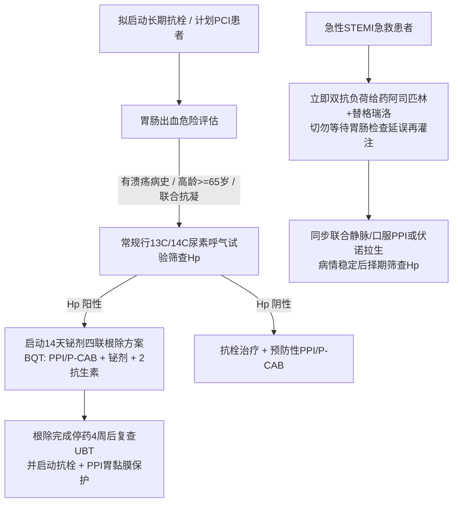

# 消化道溃疡幽门螺杆菌根除与心脑血管抗栓胃黏膜保护

## 一、 临床核心矛盾：缺血血栓 vs 消化道大出血
在心血管急重症与慢性动脉粥样硬化治疗中，以 [[急性ST段抬高型心肌梗死]]、介入支架术后及脑卒中为代表的患者，必须接受强效双联抗血小板治疗（DAPT，详见 [[替格瑞洛与阿司匹林]]）以预防致命性支架内急性血栓形成。

然而，阿司匹林通过抑制胃黏膜 COX-1 减少保护性前列腺素合成，加之 P2Y12 拮抗剂阻断血小板聚集与组织修复，极易诱发急性胃黏膜病变与消化道大出血。而 **[[幽门螺杆菌感染]]** 则是导致胃黏膜屏障损毁、促发阿司匹林相关性溃疡出血的**最强独立协同催化因子**（使溃疡出血风险激增 4~5 倍）。

---

## 二、 跨学科协同防治路径

---

## 三、 关键药物相互作用（DDI）与临床规避规范

消化科抑酸药物与心血管抗栓药物在肝脏细胞色素 P450 酶代谢途径上存在重要的潜在相互作用，临床必须严格鉴别选择：

| 药物组合方案 | 相互作用机制与风险 | 临床推荐等级与应对策略 | 对应指南参考 |
| :--- | :--- | :--- | :--- |
| **氯吡格雷 + 奥美拉唑 / 埃索美拉唑** | 奥美拉唑强效竞争性抑制肝脏 **CYP2C19** 酶，阻断氯吡格雷转化为活性代谢物，导致抗血小板效力骤降，**支架内再狭窄与血栓风险激增** | **避免合用！** 若必须使用氯吡格雷，换用对 CYP2C19 抑制微弱的**雷贝拉唑**或**泮托拉唑** | [[SRC-CMA-CARD-2019-03]] [[慢病多药联合安全与禁忌规避]] |
| **替格瑞洛 + 任意 PPI / P-CAB** | 替格瑞洛属于直接活性前体药物，无需经 CYP2C19 代谢活化 | **首选安全组合！** 替格瑞洛不受奥美拉唑等抑酸药影响，疗效稳定 | [[替格瑞洛与阿司匹林]] |
| **抗栓患者 + 伏诺拉生 (P-CAB)** | 伏诺拉生主要经 CYP3A4 代谢，对 CYP2C19 影响小，首剂即达全效抑酸 | **强推荐！** 起效迅速，黏膜保护效力强且相互作用低 | [[铋剂四联抗幽门螺杆菌药物]] |

---

## 四、 抗栓治疗中合并急性消化道大出血的急救流程
1. **轻度出血（黑便但血流动力学稳定，Hb 下降 <20 g/L）**：
   - 不轻易停用抗血小板药物（特别是植入药物支架 1~3 个月内极高危期）；
   - 立即给予大剂量静脉 PPI 泵注，加服黏膜保护剂。
2. **重度大出血（呕血、便血、休克，Hb 下降 >30 g/L）**：
   - 立即暂停所有抗栓药物，紧急内镜下电凝/钛夹止血；
   - 止血成功后血流动力学平稳 24~48 小时内，尽早恢复单药抗血小板（如替格瑞洛或阿司匹林单药），并在出血完全受控后恢复 DAPT。

---

## 五、 关联页面与反向引用
- **权威指南来源**: [[SRC-CMA-GAST-2022-01]], [[SRC-CMA-CARD-2019-03]], [[SRC-CMA-CARD-2024-01]]
- **核心疾病实体**: [[幽门螺杆菌感染]], [[急性ST段抬高型心肌梗死]], [[动脉粥样硬化性心血管疾病]]
- **核心药物实体**: [[铋剂四联抗幽门螺杆菌药物]], [[替格瑞洛与阿司匹林]]
- **核心诊疗概念**: [[幽门螺杆菌尿素呼气试验与耐药规范]], [[STEMI急诊绿色通道与直接PCI时效指标]]
- **交叉专题链接**: [[冠心病与急性心肌梗死抗栓联合降脂全景管理]], [[慢病多药联合安全与禁忌规避]]
