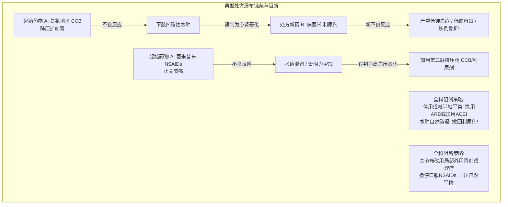

# 社区老年人多重用药处方重整与处方瀑布阻断

## 一、 临床背景：老年多病共存与“药物越来越多”的死结
在社区全科门诊，65岁以上老年人常同时患有 [[原发性高血压]]、[[2型糖尿病]]、高脂血症、退行性骨关节炎、胃食管反流及慢性失眠（[[老年多病共存]]）。由于患者频繁往返于心内科、内分泌科、骨科、神经科等不同专科，各科医生仅依据各自单病指南开具处方，导致患者日常口服药物迅速达到 8~12 种。

这种过度多重用药不仅导致老年人经济负担沉重、依从性断崖式下跌，更诱发严重的药物相互作用（DDI）和“**处方瀑布（Prescribing Cascade）**”。全科医生作为全人健康的统筹者，必须发挥“药物审查与安全刹车阀”的枢纽功能。

---

## 二、 四大常见基层处方瀑布深度剖析与阻断对策

### 基层全科必须熟记的四大处方瀑布对照：
1. **钙通道阻滞剂（氨氯地平） -> 循环利尿剂（呋塞米/氢氯噻嗪）**：
   - 机制：二氢吡啶类 CCB 扩张微小动脉强于微小静脉，毛细血管内静水压增高导致液体外渗至踝部皮下形成水肿；
   - 误判与危害：误认为“心力衰竭”或“肾功能恶化”盲目加开利尿剂，导致老年人脱水、低钠血症、低钾血症及起立性头晕跌倒；
   - **全科阻断**：换用经静脉扩张平衡的降压药物（如 ARB/ACEI 抵消毛细血管前高压），或适度减量，绝不滥加利尿剂。
2. **非甾体抗炎药（NSAIDs 塞来昔布/布洛芬） -> 加用降压药**：
   - 机制：NSAIDs 抑制前列腺素合成，促发肾脏水钠潴留并削弱降压药效力（收缩压升高 3~6 mmHg）；
   - **全科阻断**：骨关节退行性疼痛首选局部外用凝胶或物理康复训练，限制口服镇痛药使用周期在 1~2 周内。
3. **胆碱酯酶抑制剂（多奈哌齐） -> 抗胆碱药（奥昔布宁/索利那新）**：
   - 机制：多奈哌齐治疗认知障碍引起膀胱平滑肌张力升高发生尿失禁；
   - 误判与危害：加开抗胆碱药对抗乙酰胆碱，导致中枢认知障碍急剧恶化并诱发谵妄；
   - **全科阻断**：评估认知药剂量，指导定时排尿行为疗法，停用抗胆碱药。
4. **抑酸药（长期大剂量 PPI） -> 降钙剂/维生素补充剂**：
   - 机制：长期低胃酸抑制胃肠道主动转运吸收离子钙与维生素 B12，诱发骨质疏松与外周神经病变；
   - **全科阻断**：根除幽门螺杆菌后及时停用 PPI。

---

## 三、 社区药物重整与“棕色药袋法”规范操作流程

根据《基层医疗卫生机构老年人多重用药与慢病共病全科安全管理指南》（[[SRC-CSGP-GERI-2023-02]]），家庭医生签约团队每年至少对签约高龄老年人开展 **1 次全面的药物重整（Medication Reconciliation）**：

1. **预约宣教**：嘱患者或照料者将家中所有正在服用的西药、中药汤剂、中成药、维生素、补品（无论是在三甲医院开的还是药店自购的）全部装在一个棕色大袋子中；
2. **现场面对面逐药核对**：
   - “这盒药您每天实际吃几次？每次吃几粒？”（识别少服、漏服或过量服药）；
   - “这两种降压药名字不一样，但里面成分都是氨氯地平，您是不是每天同时吃了两遍？”（排除重复用药）；
3. **应用 PIM 标准逐项排雷**：
   - 坚决剔除长效安定类、第一代扑尔敏、格列本脲等高危药品；
4. **执行处方精简五步法**：详见概念专页：[[老年多重用药筛查与处方精简五步法]]。

---

## 四、 关联页面与反向引用
- **权威指南来源**: [[SRC-CSGP-GERI-2023-02]], [[SRC-CMA-CARD-2024-01]], [[SRC-CDS-ENDO-2024-01]]
- **核心疾病实体**: [[老年多病共存]], [[原发性高血压]], [[2型糖尿病]], [[慢性心力衰竭]]
- **核心概念规范**: [[老年多重用药筛查与处方精简五步法]], [[高血压分级与靶器官损害评估]]
- **用药安全协同**: [[慢病多药联合安全与禁忌规避]]
- **权威组织机构**: [[中华医学会全科医学分会]]
