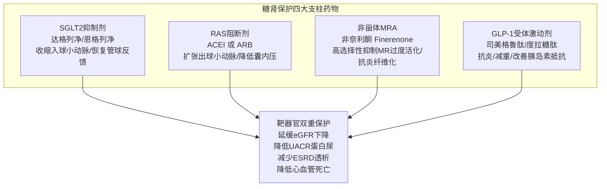

# 糖尿病合并慢性肾脏病双重保护与用药警戒

## 一、 临床背景：糖尿病肾病（DKD）的双重危机
我国成人糖尿病患病率达 11.2%，其中约 30%~40% 的患者会发展为糖尿病肾病（Diabetic Kidney Disease, DKD），现已超越原发性肾小球肾炎成为我国城镇住院患者中 [[慢性肾脏病]] 的首要致病原因。

[[2型糖尿病]] 合并慢性肾脏病患者面临“**肾衰竭透析风险**”与“**致死性心血管事件风险**”的双重几何级叠加。临床治疗必须从单纯关注“降血糖”跨越至“**心肾代谢器官双重保护与肾功能分期剂量精细微调**”。

---

## 二、 肾心靶向保护“四大基石”联合架构

---

## 三、 基于 CGA 肾功能分期的药物精细调整与警戒红线

根据《中国慢性肾脏病早期筛查、诊断及治疗临床实践指南》（[[SRC-CMA-NEPH-2024-01]]）与《中国2型糖尿病防治指南（2024版）》（[[SRC-CDS-ENDO-2024-01]]），降糖与降压药物必须严格依据估算肾小球滤过率（eGFR，单位 mL/min/1.73m²）进行剂量滴定与禁忌把控：

| 药物类别 | 代表药物 | eGFR ≥ 60 (G1-G2期) | eGFR 45 ~ 59 (G3a期) | eGFR 30 ~ 44 (G3b期) | eGFR < 30 (G4-G5期) |
| :--- | :--- | :--- | :--- | :--- | :--- |
| **双胍类** | [[二甲双胍]] | 常规推荐全量（1500~2000 mg/d） | 减量使用（最大 1000 mg/d） | 密切监测，最大 500 mg/d，必要时停药 | **绝对禁用！**（防致死性乳酸酸中毒） |
| **SGLT2抑制剂** | [[SGLT2抑制剂]]（达格列净） | 强化推荐 10 mg qd | 强化推荐 10 mg qd | 推荐 10 mg qd | eGFR ≥20 可起始；透析前已用者可维持，但不新加 |
| **GLP-1RA** | [[GLP-1受体激动剂]]（司美格鲁肽） | 优先推荐，保护心血管 | 优先推荐，无需调量 | 优先推荐，无需调量 | 重度肾衰（eGFR <15）缺乏数据，慎用 |
| **RAS阻断剂** | [[RAS抑制剂]]（ACEI / ARB） | 蛋白尿首选 | 维持治疗，监测血钾肌酐 | 维持治疗，严密监测 | eGFR <15 谨慎评估或停药；严禁双联 |
| **降尿酸药** | [[降尿酸与抗炎药物]]（非布司他） | 推荐起始 20~40 mg/d | 无需调整剂量 | 推荐使用，减轻肾脏负担 | eGFR <30 慎用；苯溴马隆与秋水仙碱禁用 |

---

## 四、 核心用药安全监测与临床处置红线

1. **二甲双胍乳酸酸中毒警报**：
   - 当 eGFR < 30 mL/min 时药物排泄显著减退，体内乳酸急剧蓄积导致死亡率高达 50% 的乳酸酸中毒；患者行造影检查（使用含碘对比剂）前 48 小时必须停用二甲双胍。
2. **RAS 抑制剂的“30% 黄金法则”**：
   - 启用 ACEI/ARB 后 2~4 周复查血肌酐与血钾；
   - 若血肌酐较基线**升高幅度 < 30%**：属于降低肾小球囊内高压的良性生理效应，**切勿轻易停药**；
   - 若血肌酐**升高 > 30%** 或 **血清钾 > 5.5 mmol/L**：需停药并排查双侧肾动脉狭窄。
3. **SGLT2 抑制剂正常血糖酮症酸中毒（euDKA）防范**：
   - 在患者处于严重感染、急性心梗、手术创伤或极低碳水摄入应激下，即便血糖处于正常范围（<11.1 mmol/L），亦可发生严重代谢性酸中毒；择期手术前必须停用 3~4 天。

---

## 五、 关联页面与反向引用
- **权威指南来源**: [[SRC-CDS-ENDO-2024-01]], [[SRC-CMA-NEPH-2024-01]], [[SRC-CMA-CARD-2024-01]]
- **核心疾病实体**: [[2型糖尿病]], [[慢性肾脏病]], [[原发性高血压]], [[痛风与高尿酸血症]]
- **核心药物实体**: [[SGLT2抑制剂]], [[二甲双胍]], [[GLP-1受体激动剂]], [[RAS抑制剂]], [[降尿酸与抗炎药物]]
- **核心诊疗概念**: [[CKD病因-GFR-白蛋白尿CGA分期]], [[2型糖尿病诊断切点与控制目标]]
- **综合专题协同**: [[心脑血管与代谢性疾病共病管理]], [[慢病多药联合安全与禁忌规避]]
