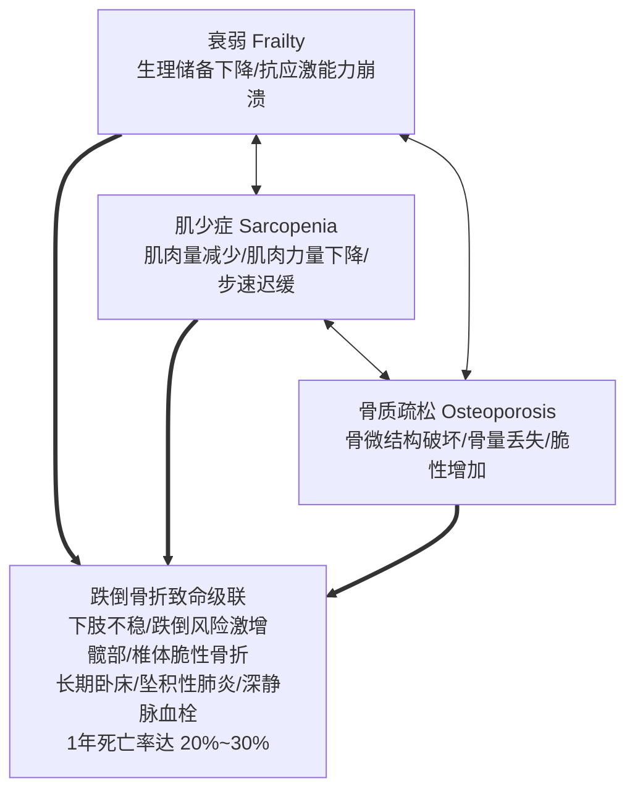
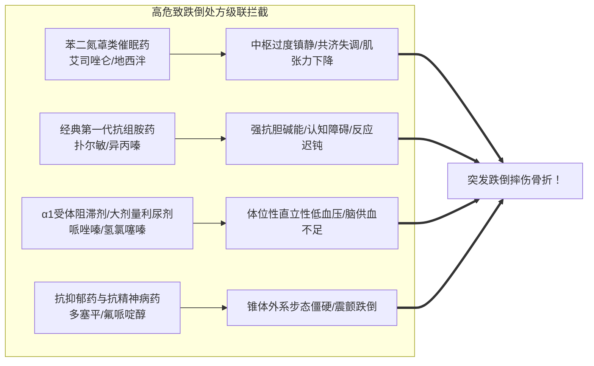

# 老年衰弱与肌少症合并骨质疏松综合管理

## 一、 临床背景：“衰弱-肌少-骨松”致残多米诺级联
随着我国人口深度老龄化，≥65岁老年人群中常呈现**衰弱（Frailty）**、**肌少症（Sarcopenia）**与**骨质疏松（Osteoporosis）**高度重叠共存的“骨肌衰弱综合征”。

临床治疗若仅孤立“补钙”，极易陷入“越骨折越卧床、越卧床肌肉越萎缩、衰弱越重”的死亡漩涡。全科与多学科团队必须建立“**抗骨松药物 + 蛋白质营养支持 + 抗阻康复锻炼 + 处方瀑布阻断与防跌倒**”四位一体的综合闭环。

---

## 二、 临床筛查、评估量表与精准切点

根据亚洲肌少症工作组（AWGS 2019）、《原发性骨质疏松症诊疗指南》（[[SRC-CMA-ENDO-2022-01]]）及《基层医疗卫生机构老年人多重用药与慢病共病全科安全管理指南》（[[SRC-CSGP-GERI-2023-02]]）：

| 评估维度 | 推荐筛查工具 / 检查方法 | 阳性确诊切点与临床意义 |
| :--- | :--- | :--- |
| **衰弱评估** | FRAIL 量表（疲劳、阻力、行走、疾病、减重） | 0分为健康健硕，1～2分为衰弱前期，**≥3分确诊衰弱** |
| **肌肉力量** | 弹簧/电子握力计握力测定 | **男性 < 28.0 kg，女性 < 18.0 kg** 提示肌力显著下降 |
| **躯体功能** | 6米步速测试 或 5次起坐测试 | **6米步速 < 1.0 m/s** 或 5次起坐时间 ≥ 12秒确诊功能受损 |
| **骨骼肌量** | 双能X线吸收法 (DXA) 或 生物电阻抗 (BIA) | 骨骼肌质量指数 (SMI)：DXA 男<7.0 / 女<5.4 kg/m² |
| **骨密度** | 中轴骨（腰椎L1-L4或股骨颈）DXA 骨密度 | **T值 ≤ -2.5**，或发生脆性骨折即确诊重度骨质疏松 |

---

## 三、 四位一体综合干预策略

### 1. 骨质疏松靶向分级治疗
- **基础补充**:
  - 钙剂：元素钙 500～600 mg/d（餐后口服 [[碳酸钙D3片]]）；
  - 维生素 D：普通维生素 D 800～1200 IU/d，老年衰弱患者建议优选活性维生素 D（[[骨化三醇胶丸]] 0.25 μg qd）。
- **抗骨吸收一线**:
  - [[阿仑膦酸钠片]]：70mg 每周 1 次，清晨空腹立位满杯白水送服，服后保持直立 30 分钟（严防化学性食管溃疡）；**严禁用于 eGFR < 35 ml/min 患者**；
  - 地舒单抗（Denosumab）：60mg 每 6 个月皮下注射 1 次，不经肾脏排泄，各期肾功能不全均安全适用。
- **极高骨折风险**:
  - 促骨形成药特立帕肽（Teriparatide）20 μg/d 皮下注射，疗程最长 24 个月。

### 2. 营养与蛋白质代谢干预
- **蛋白质供给**: 衰弱老年人每日蛋白质摄入量应提高至 **1.2～1.5 g/kg/d**，其中优质蛋白（鱼肉、蛋奶、大豆蛋白）占 50% 以上；
- **支链氨基酸 (BCAA) 与亮氨酸**: 每日补充亮氨酸 2.5～3.0 g 或乳清蛋白粉，直接激活雷帕霉素靶蛋白（mTOR）通路，刺激骨骼肌蛋白质合成。

### 3. 抗阻训练与防跌倒物理康复
- **渐进性抗阻运动**: 每周 2～3 次弹力带练习、负重微蹲、坐立练习；
- **平衡与步态训练**: 太极拳、单脚站立、Otago 防跌倒运动，强化神经本体感觉。

---

## 四、 处方精简与高危致跌倒药物 (FRIDs) 拦截

老年衰弱患者由于肝肾清除率下降与受体敏感度升高，药物相关跌倒骨折风险极高。处方系统必须严格遵循 **Beers 2023 标准** 与 **STOPP/START 准则**：

### 关键处方干预路径
1. **镇静催眠药去处方**: 阶梯渐进减停艾司唑仑，过渡至认知行为疗法（CBTI）或小剂量退黑素受体激动剂；
2. **前列腺用药防跌倒**: 坦索罗辛严格指导睡前服药，避免夜起过猛导致直立性低血压晕厥；
3. **利尿剂剂量重整**: 慢性心衰稳定期避免盲目大剂量强力利尿，防止有效循环血容量不足。

---

## 五、 指南依据与溯源网络
- 循证指南: [[SRC-CSGP-GERI-2023-02]], [[SRC-CMA-ENDO-2022-01]]
- 关联疾病: [[骨质疏松症]], [[原发性高血压]], [[慢性肾脏病]]
- 诊疗规范: [[骨密度DXA诊断切点与双膦酸盐给药规范]], [[老年多重用药筛查与处方精简五步法]]
- 临床协议: [[PROT-OSTEO-021 原发性骨质疏松症门诊阶梯抗骨吸收与防跌倒方案|PROT-OSTEO-021]], [[PROT-POLY-012 社区老年共病多重用药处方重整与去处方干预方案|PROT-POLY-012]]
